Configuration Management and the Cloud
======================================

by Google

# Module 1
#
## Title: Automating with Configuration Management

## Course Introduction

### Course Introduction

* __Puppet__, the current industry standard for configuration management

## Introduction to Automation at Scale

### What is scale?

* __Scalable System__
	* Being able to __scale__ "what we do" means that we can keep achieving larger impacts with the same amount of effort
	* When a system scales well, an increase in the amount of work it needs to do can be accommodated by an increase in capacity
	* For example
		* If the web application your company provides is scalable, that it can handle an increase in the number of people using it by adding more servers to serve requests
	* __In short, a scalable system is a flexible one__
	* To figure out __how scalable your current setup__ is, you can __ask yourself questions__ like
		1. will adding more servers increase the capacity of the service?
		1. How are new servers prepared, installed, and configured?
		1. How quickly can you set up new computers to get them ready to be used?
		1. Could you deploy a hundred servers with the same IT team that you have today?
			1. would you need to hire more people to get it done faster?
		1. Would all the deployed servers be configured exactly the same way?
	* Scaling isn't just about website serving content of course
		* If your company is rapidly hiring a lot of new employees, you'll need to have an onboarding process that can scale as needed
		* And as you keep adding new computers to the network, you'll need to make sure that your system administration process can scale to the growing needs of the company
		* This can include tasks like 
			1. a applying the latest security policies and patches while making sure users' needs still get addressed
* __Automation__
	* __Automation__ is an essential tool for keeping up with the infrastructure needs of a growing business
	* By using the right automation tools, we can get a lot more done in the same amount of time
	* For example
		1. We could deploy a whole new server by running a single command and letting the automation take care of the rest
		1. We could also create a batch of user accounts with all the necessary permissions based on data already stored in the database, eliminating all human interaction
	* Automation is what lets us scale
		* It allows a small IT team to be in charge of hundreds or even thousands of computers

> A __scalable system__ is a flexible system that can handle extra tasks or integrate extra resources easily
#
> __Automation__ breeds consistency, when we know a particular process that has been automated works, we can count on it working every time as long as everything remains the same

* What benefits can we gain by using automation to manage our configuration?
	1. Consistency
	1. Reliability
	1. Scalability

### What is configuration management?

* Manually deploying a server means that the configuration is unmanaged
* So what would it mean for the configuration to be managed?
	* It means using a __configuration management system__ to handle all of the configuration of the devices in your fleet, also known as __nodes__
			

			  <a href="javascript:void(0)" rel="noopener">
				 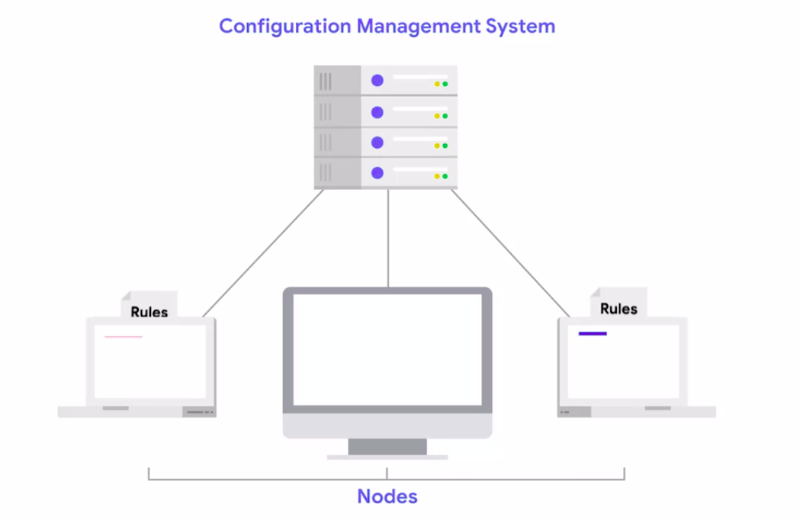</a>
			

		* Typically you'll define a set of rules that have to be applied to the nodes you want to manage and then have a process that ensures that those settings are true on each of the nodes
	* At a small scale, unmanaged configurations seem inexpensive
		* If you only manage a handful of servers, you might be able to get away with doing that without the help of automation
		* But this approach doesn't always scale well. The more servers that you need to deploy, the more time it will take you to do it manually
		* And when things go wrong, and they often do, it can take a lot of time to recover and have the servers back online
* Configuration management systems aim to solve this scaling problem
	* By managing the configuration of a fleet with a system like this, large deployments become easier to work with because the system will deploy the configuration automatically no matter how many devices you're managing
	* When you use configuration management and you need to make a change in one or more computers, you don't manually connect to each computer to perform operations on it
		* Instead, you edit the configuration management rules and then let the automation apply those rules in the affected machines
			

			  
			

		* This way the changes you make to a system or group of systems are done in a systematic, repeatable way
			* Being repeatable is important because it means that the results will be the same on all the devices
	* A __configuration management tool__ can take the rules you define and apply them to the systems that it manages, making changes efficient and consistent
	* __Configuration management systems__ often also have some form of __automatic error correction built in__ so that they can recover from certain types of errors all by themselves
	* For example
		* say you found that some application that was being used widely in your company was configured to be very insecure
			* You can add rules to your configuration management system to improve the settings on all computers
			* And this won't just apply the more secure settings once
			* It will continue to monitor the configuration going forward
			* If a user changes the settings on their machine, the configuration management tooling will detect this change and reapply the settings you defined in code
				

				  <a href="javascript:void(0)" rel="noopener">
					 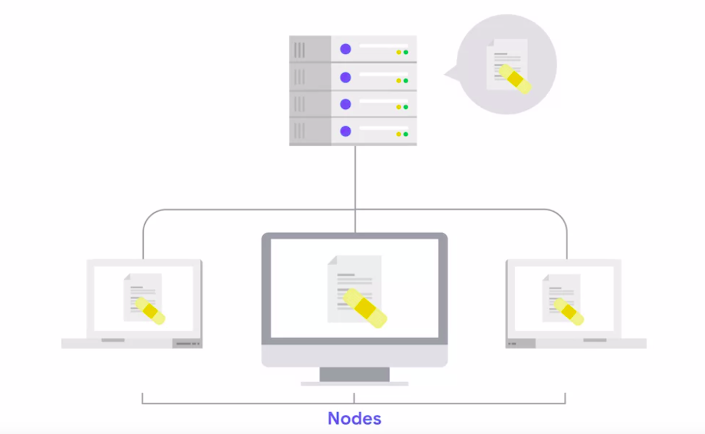</a>
				

* There are __lots__ of __configuration management systems__ available in the IT industry today
	* Some popular systems include __Puppet__, __Chef__, __Ansible__, and __CFEngine__
	* These tools can be used to manage locally hosted infrastructure
		* Think bare metal or virtual machines, like the laptops or work stations that employees use at a company
	* Many also have some kind of __Cloud integration__ allowing them to manage resources in Cloud environments like __Amazon EC2__, __Microsoft Azure__, or the __Google Cloud platform__, etc
	* There are some platform specific tools, like __SCCM and Group Policy__ for __Windows__
		* These tools can be very useful in some specific environments, even when they aren't as flexible as the others
* __NOTE:__
	* Keep in mind though that selecting a configuration management system is a lot like deciding on a programming language or version control system
	* You should pick the one that best fits your needs and adapt accordingly, if necessary
	* Each has its own strengths and weaknesses. So a little research beforehand can help you decide which system is best suited for your particular infrastructure needs

> __CFEngine__ is an open-source configuration management program that offers automated configuration and maintenance of large-scale computing networks, including centralized cloud, desktop, consumer and industrial application control, embedded networked applications, handheld smartphones, and tablet computers
#
> __Ansible__ is an open source IT Configuration Management, Deployment & Orchestration tool which aims to provide a wide variety of automation challenges with huge productivity gains

### What is infrastructure as code?

* When we use a configuration management system, we write rules that describe how the computers in our fleet should be configured
	* These rules are then executed by the automation, to make the computers match our desired state
	* This means that we can model the behavior of our IT infrastructure in files that can be processed by automatic tools
		* These files can then be tracked in a version control system
* __Infrastructure as Code__
	* __Remember__, version control systems help us keep track of all changes done to the files, helping answer questions like who, when, and why
		* More importantly, they're super-useful when we need to revert changes
			* This can be especially helpful if a change turns out to be problematic
	* The paradigm of storing all the configuration for the managed devices in version controlled files is known as __Infrastructure as Code__ or __IaC__
		* In other words, we see that we're using Infrastructure as Code when all of the configuration necessary to deploy and manage a node in the infrastructure is stored in version control
			* This is then combined with automatic tooling to actually get the nodes provisioned and managed
	* If you have all the details of your Infrastructure properly stored in the system, you can very quickly deploy a new device if something breaks down
		* Simply get a new machine, either virtual or physical, use the automation to deploy the necessary configuration, and you're done
	* The __principals of Infrastructure as Code__ are commonly applied in cloud computing environments, where __machines__ are __treated__ like __interchangeable resources__, instead of individual computers
		* This principle is also known as treating your computers as __cattle__ instead of pets because you care for them as a group rather than individually
		* This concept isn't just for managing computers in huge data centers or globe spanning infrastructures, it can work for anything; from servers to laptops, or even workstations in a small IT department
	* One valuable __benefit of this process__ is that the configuration applied to the device doesn't depend on a human remembering to follow all the necessary steps
		* the result will always be the same, making the deployment consistent
* __VCS__ or __Version Control System__
	* Since the configuration of our computers is stored in files, those files can be added to a VCS
	* This has all the benefits that version control systems bring
		1. It gives us an audit trail of changes
		1. it lets us quickly rollback if a change was wrong
		1. it lets others reviewed our code to catch errors and distribute knowledge
		1. it improves collaboration with the rest of the team
		1. it lets us easily check out the state of our infrastructure by looking at the rules that are committed
	* The ability to easily see what configuration changes were made and roll back to a known good state is super important
	*  It can make a big difference in quickly recovering from an outage, especially since changing the contents of the configuration file can be as dangerous as updating the version of an application
	* Having the rules stored in files means that we can also run automated tests on them
		* It's much better to find out in a test that a configuration file has a typo in it than to find out from our users
	* In a complex or large environment, treating your IT Infrastructure as Code can help you deploy a flexible scalable system
* A configuration management system can help you manage that code by providing a platform to maintain and provision that infrastructure in an automated way
* Having your infrastructure stored as code means that you can automatically deploy your infrastructure with very little overhead
* If you need to move it to a different location, it can be deployed, de-provisioned, and redeployed at scale in a different locale with minimal code level changes
* __SUMMARY__
	* Managing your Infrastructure as Code it means that your fleet of nodes are
		1. consistent
		1. versioned
		1. reliable
		1. repeatable
	* Instead of being seen as precious or unique, machines are treated as replaceable resources that can be deployed on-demand through the automation
	* Any infrastructure that claims to be scalable must be able to handle the capacity requirements of growth

> When a configuration or process doesn't depend on a human remembering to follow all the necessary steps, the result will always be the same

* What is the principle called when you think of networked machines as interchangeable resources instead of individual machines?
	* Treating computers like "cattle instead of pets"
		* This means no node is irreplaceable and configuration is automated

## Introduction to Puppet

### What is Puppet?

* __Puppet__ is the current industry standard for managingthe configuration of computers in a fleet of machines
* The reason __why Puppet is so popular__ is that it's a cross-platform tool that's been around for a while
	* It's an open source project that was created in 2005,and it's gone through several different versions
	* As it's evolved, the tool has incorporated feedbackfrom its users to make it more and more useful
* We typically __deploy puppet__ using a __client-server architecture__
	* __The client__ is known as the __Puppet agent__
	* __The service__ is known as the __Puppet master__
	* When using this model
		1. The agent connects to the master and sends a bunch of facts that describe the computer to the master
		1. The master then processes this information, generates the list of rules that need to be applied on the device, and sends this list back to the agent
		1. The agent is then in charge of making any necessary changes on the computer
				

				  <a href="javascript:void(0)" rel="noopener">
					 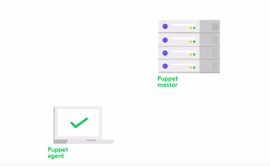</a>
				

* Puppet is a cross-platform application available for all Linux distributions, Windows, and Mac OS
	* This means that you can use the same puppet rules for managing a range of different computers
* __RULES__
	* What are these rules that we keep talking about? 
		* Example
					

					  <a href="javascript:void(0)" rel="noopener">
						 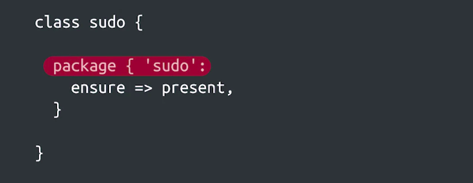</a>
					

			* This block is saying that the package 'sudo' should be present on every computer where the rule gets applied
			* If this rule is applied on 100 computers, it would automatically install the package in all of them
	* Puppet will determine the type of operating system being used and select the right tool to perform the package installation
		* On __Linux__ distributions, there are several package management systems like APT, Yum, and DNF
	* Puppet will also determine which package manager should be used to install the package
		* On __Mac OS__, there's a few different available providers depending on where the package is coming from
			* The Apple Provider is used for packages that are part of the OS, while the MacPorts provider is used for packages that come from the MacPorts Project
		* For __Windows__, we'll need to add an extra attribute to our rule, stating where the installer file is located on the local desk or a network mounted resource
			* Puppet will then execute the installer and make sure that it finishes successfully
			* If you use __Chocolatey__ to manage your windows packages, you can __add__ an extra __Chocolatey provider__ to Puppet to support that
	* Using rules like this one, we can get puppet to do a lot more than just install packages for us
		* We can __add__, __remove__, or __modify__ __configuration files__ stored in the system, or __change registry entries__ on Windows
		* We can also __enable__, __disable__, __start__, or __stop__ the __services__ that run on our computer
		* We can configure __crone jobs__, the __scheduled tasks__, __add__, __remove__, or __modify__ __Users and Groups__ or even __execute__ external __commands__

### Puppet Resources

* __Resources__ are the basic unit for modeling the configuration that we want to manage
	* In other words, each resource specifies one configuration that we're trying to manage, like a service, a package, or a file
* Example
	1. Example 1 : File Resource
						

						  <a href="javascript:void(0)" rel="noopener">
							 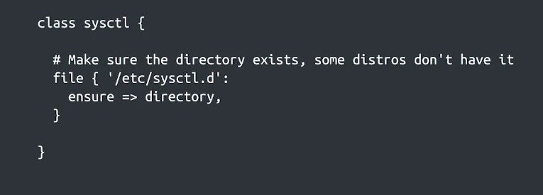</a>
						

		* In this case, we're defining a file resource
		* This resource type is used for managing files and directories
		* In this case, it's a very simple rule that ensures that `/etc/sysctl.d` exists and is a directory
		* When declaring a resource in puppet, we write them in a block that starts with the resource type ,in this case __File__
			* The configuration of the resource is then written inside a block of curly braces
			* Right after the opening curly brace, we have the title of the resource, followed by a colon
			* After the colon come the attributes that we want to set for the resource
				*  In this example, we're once again setting the insurer attribute with directory as the value
	1. Example 2 : File Resource
						

						  <a href="javascript:void(0)" rel="noopener">
							 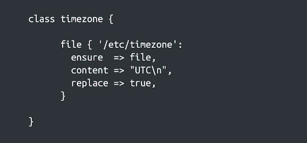</a>
						

		* In this example, we're using a file resource to configure the contents of `/etc/timezone`
			* This file is used in some Linux distributions to determine the time zone of the computer
		* This resource has three attributes
			1. First, we explicitly say that this will be a file instead of a directory or a symlink, by setting __ensure__ attribute
			1. Then we set the __contents__ of the file to the __UTC__ time zone
			1. Finally, we set the __replace__ attribute to __true__, which means that the contents of the file will be replaced even if the file already exists
* Some other attributes that we can set are
	1. File Permission
	1. File Owner
	1. File Modification Time
* How do these rules turn into changes in our computers?
	* When we declare a resource in our puppet rules
		* We're defining the desired state of that resource in the system
	* The puppet agent then turns the desired state into reality using providers
	* The provider used will depend on the resource defined and the environment where the agent is running
		* Puppet will normally detect this automatically without us having to do anything special
	* When the puppet agent processes a resource, it first decides which provider it needs to use
						

						  <a href="javascript:void(0)" rel="noopener">
							 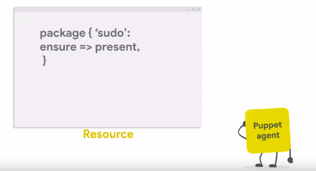</a>
						

		* Then passes along the attributes that we configured in the resource to that provider
	* The code of each provider is in charge of making our computer reflect the state requested in the resource
						

						  
						

> The most basic unit in Puppet is a resource, such as user, group, file, service or package

### Puppet Classes

* In the examples of Puppet code that we've seen so far, we've declared classes that contain one resource
* What these classes are for?
	* We use these classes to collect the resources that are needed to achieve a goal in a single place 
	* For example
		* You could have a class 
			1. that installs a package
			1. sets the contents of a configuration file
			1. starts the service provided by that package
	* For Example
						

						  <a href="javascript:void(0)" rel="noopener">
							 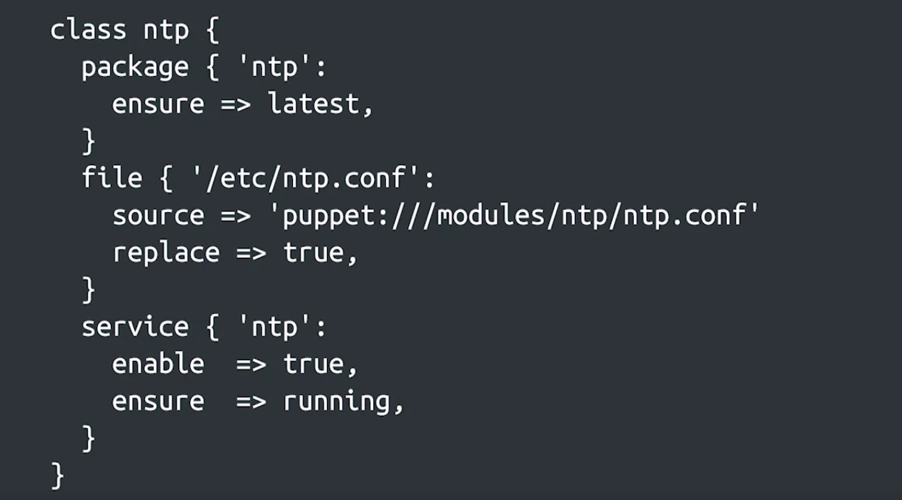</a>
						

		* In this case, we have a class with three resources
			1. a package
			1. a file
			1. a service
		* All of them are related to the Network Time Protocol, or NTP, the mechanism our computers use to synchronize the clocks
		* Our rules are making sure that the NTP package is always upgraded to the latest version
			* We're setting the contents of the configuration file using the __source__ attribute
				* which means that the agent will read the required contents from the specified location
		* And we're saying that we want the NTP service to be enabled and running
		* By grouping all of the resources related to NTP in the same class, we only need a quick glance to understand how the service is configured and how it's supposed to work
	* Grouping would make it easier to make changes in the future since we have all the related resources together
		* It makes sense to use this technique whenever we want to group related resources
		* For Example
			* You could have a class grouping all resources related to
				1. managing log files
				1. configuring the time zone
				1. handling temporary files and directories
			* You could also have classes that group all the settings related to
				1. your web serving software
				1. your email infrastructure
				1. even your company's firewall

> By grouping related resources together, we can more easily understand the configuration and make changes in the future
#
> Grouping a collection of related resources into a single class simplifies configuration management by, for one example, allowing us to apply a single class to each host rather than having to specify every resource for each host separately and possibly missing some
#
> Puppet assigns providers according to predefined rules for the resource type and data collected from the system such as the family of the underlying operating system
#
> Puppet has many useful attributes. "Replace" set to True tells Puppet to replace files or symlinks that already exist on the local system but whose content doesn’t match what the source or content attribute specifies

## The Building Blocks of Configuration Management

### What are domain-specific languages?

* We can do more complex operations using Puppet's __Domain Specific Language__ or __DSL__
* Typical programming languages like **Python**, **Ruby**, **Java** or **Go** are __General Purpose Languages__
	* That can be used to write lots of different applications with different goals and use cases
* A **D**omain **S**pecific **L**anguage or **DSL** is a programming language that's more limited in scope
	* Learning a **D**omain **S**pecific **L**anguage or **DSL** is usually much __faster__ and __easier__ than learning a general purpose programming language because there's a lot less to cover
		* You don't need to
			1. learn as much syntax
			1. understand as many keywords
			1. taking to account a lot of overhead in general
* In the case of Puppet, the __DSL__ is limited to operations related to __when__ and __how__ to apply configuration management rules to our devices
* For example
	1. We can use the mechanisms provided by the DSL to set different values on laptops or desktop computers
	1. to install some specific packages only on the company's web servers
* On top of the basic resource types that we already checked out, __Puppet's DSL includes__
	1. variables
	1. conditional statements
	1. functions
* Using Puppet's DSL, we can apply different resources or set attributes to different values depending on some conditions
* __Facts__ are variables that represent the characteristics of the system
	* When the Puppet agent runs, it calls a program called __factor__
		* which analyzes the current system, storing the information it gathers in these __facts__
	* Once it's done, it sends the values for these __facts__ to the __server__, which uses them to calculate the rules that should be applied
						

						  <a href="javascript:void(0)" rel="noopener">
							 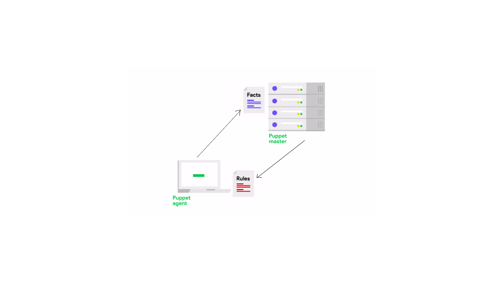</a>
						

* Puppet comes with a bunch of __baked-in core facts__ that store useful information about the system like
	1. what the current OS is
	1. how much memory the computer has
	1. whether it's a virtual machine or not
	1. what the current IP address is
* If the information we need to make a decision isn't available through one of these __facts__ mentioned above
	* we can also write a script that checks for the information and turns it into our own __custom fact__
	* For Example
						

						  <a href="javascript:void(0)" rel="noopener">
							 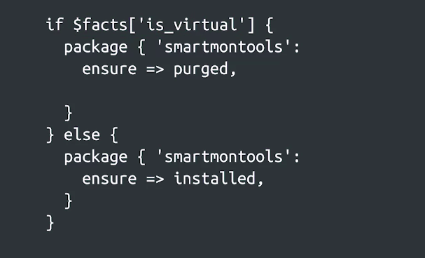</a>
						

		* This piece of code is using the __is_virtual fact__ together with a conditional statement to decide whether the __smartmontools package__ should be installed or purged
			* __smartmontools package__ package is used for monitoring the state of hard drives using smart
			* So it's useful to have it installed in physical machines, but it doesn't make much sense to install it in our virtual machines
		* Elements that are present in the syntax above
			1. First, facts is a variable
				* All variable names are preceded by a __dollar sign__ in Puppet's DSL
				* In particular, the __facts variable__ is what's __known as__ a __hash__ in the Puppet DSL, which is __equivalent__ to a __dictionary__ in Python
					* This means that we can access the different elements in the hash using their keys
				* In this case, we're accessing the value associated to the __is_virtual key__
			1. Second, we see how we can write a conditional statement using if else
				* enclosing each block of the conditional with curly braces
			1. Finally, each conditional block contains a package resource
				* Every __resource__ starts with the __type of resource being defined__
					* In this case, __package__
				* The __contents__ of the resource are then __enclosed in curly braces__
				* Inside the resource definition, the __first line__ contains the __title__ followed by a __colon__
					* Any lines after that are attributes that are being set
				* We use __equals greater than__ (`=>`) to assign values to the attributes and then each attribute ends with a __comma__

### The Driving Principles of Configuration Management

* The __Providers__ like apt and yum are the ones in charge of turning our goals into whatever actions are necessary
* __Puppet__ uses a declarative language because we declare the state that we want to achieve rather than the steps to get there
* Traditional languages like Python or C are called procedural because we write out the procedure that the computer needs to follow to reach our desired goal
* When it comes to configuration management, it makes sense to simply state what the configuration should be, not what the computer should do to get there
	* For Example
		* Say you're using a resource to declare that you want a package installed, you don't care what commands a computer has to run you install it, you only care that after the configuration management tool has run, the package is installed
* Another Important aspect of configuration management is that operations should be __idempotent__
* An __idempotent__ action can be performed over and over again without changing the system after the first time the action was performed, and with no unintended side effects
	* For Example
		1. Example of a file resource
						

						  <a href="javascript:void(0)" rel="noopener">
							 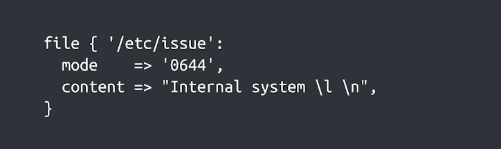</a>
						

			* This resource ensures that the `/etc/issue` file has a set of permissions and a specific line in it
			* Fulfilling this requirement is an idempotent operation
			* If the file already exists and has the desired content, then Puppet will understand that no action has to be taken
				* If the file doesn't exist, then puppet will create it
			* If the contents or permissions don't match, Puppet will fix them
			* No matter how many times the agent applies the rule, the end result is that this file will have the requested contents and permissions
* __Idempotency__ is a valuable property of any piece of automation
	* __If__ a __script__ is __idempotent__, it means that it can fail halfway through its task and be run again without problematic consequences
* Most Puppet resources provide __idempotent__ actions, and we can rest assured that __two runs of the same set of rules__ will lead to the __same end result__
	* An __exception__ to this is the __exec resource__, which runs commands for us
		* The actions taken by the __exec resource__ might __not be idempotent__ since a command might modify the system each time it's executed
* If we need to use the exec resource to run a command for us, we need to be careful to ensure that the action is idempotent
	* We could do that for example by using the onlyif attribute like this
						

						  <a href="javascript:void(0)" rel="noopener">
							 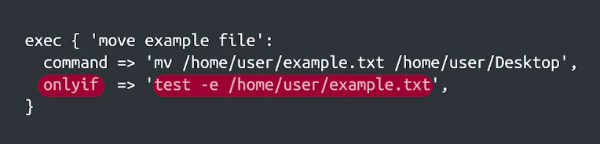</a>
						

		* Using the onlyif attribute, we specified that this command should be executed only if the file that we want to move exists
			* This means that the file will be moved if it exists and nothing will happen if it doesn't
		* By adding this conditional, we've taken an action that's not idempotent and turned it into an idempotent one
	* Another important aspect of how configuration management works is the __test and repair paradigm__
		* This means that actions are taken only when they are necessary to achieve a goal
		* Puppet will first test to see if the resource being managed like a file or a package, actually needs to be modified
			* If the file exists in the place we want it to, no action needs to be taken
			* If a package is already installed, there's no need to install it again
			* This avoids wasting time doing actions that aren't needed
	* Finally, another important characteristic is that Puppet is __stateless__, this means that there's no state being kept between runs of the agent
		* Each Puppet run is independent of the previous one, and the next one
		* Each time the puppet agent runs, it collects the current facts
		* The Puppet master generates the rules based just on those facts, and then the agent applies them as necessary

> Stateless means there is no record of previous interactions, and each interaction request has to be handled based entirely on information that comes with it

