Configuration Management and the Cloud
======================================

by Google

# Module 2
#
## Title: Deploying Puppet

## Deploying Puppet Locally

### Applying Rules Locally

* Puppet is usually deployed in a client-server architecture
	* But that's not the only way we can use Puppet
	* We can also use it as a stand-alone application run from the command line
		* This is common when testing new configurations
		* It can be the preferred configuration for complex setups where connecting to a master is no longer the best approach
* When using a stand-alone Puppet, the same computer processes the facts, calculates the rules that need to be applied, and makes any necessary changes locally
* To install Puppet in Ubuntu use: `sudo apt install puppet-master`
* In this example
	* We want to use Puppet to make sure that some useful tools for debugging problems are installed on each computer in our fleet
		* To do this, we first have to create a file where we'll store the rules that we want to apply
		* In Puppet lingo, these files are called __manifests__ and they must end with a __`.pp`__ __extension__
		* So we'll create a new file called __tools.pp__ and in this file, we'll create a package resource
			* We'll start by managing the htop package which is a tool similar to top that can show us some extra information
		* We'll state that we want Puppet to ensure that we have this package present on our computer
		* That's all we have to do
		* This resource will take care of installing the package for us
		* Executing __tools.pp__ manifest file
				<p align="center">
				  <a href="javascript:void(0)" rel="noopener">
					 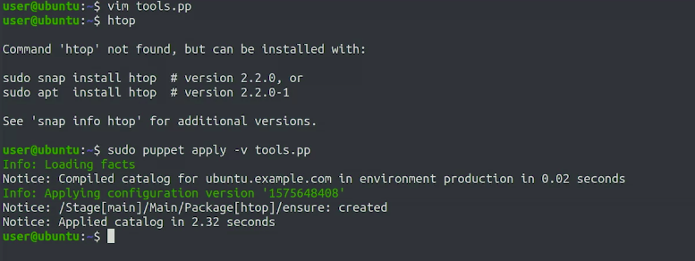</a>
				</p>
			* The `-v` flag tells Puppet that we want to get __verbose output__, which will tell us what's going on while Puppet is applying the rules in the file that we pass to it
			* So here, Puppet first told us that it was loading the facts
				* Then, that it compiled a catalog
				* After that, it told us that it was applying the current configuration
				* Then, that it installed the package we requested
				* Finally, it let us know that it finished applying this catalog
* __What's a catalog?__
	* We called out in an earlier video that after loading all facts for a computer, the server calculates which rules actually need to be applied
	* For example
		* If a packet should only be installed when a certain condition is met, this condition is evaluated on the server side based on the gathered facts
* The __catalog__ is the list of rules that are generated for one specific computer once the server has evaluated all variables, conditionals, and functions
	* In this example
		* the catalog will be exactly the same as our code because the code didn't include any variables, functions, or conditionals
	* More complex sets of rules can lead to different catalogs depending on fact values
* What happens if we try to apply the Puppet rules again now that the package is installed?
				<p align="center">
				  <a href="javascript:void(0)" rel="noopener">
					 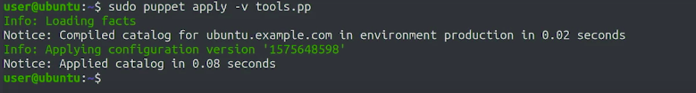</a>
				</p>
	* It noticed that the package is already installed so it didn't try to install the package again
	* This means it applied the catalog much faster because nothing had to be changed

### Managing Resource Relationships

* The Puppet manifests that we use to manage computers in our fleet usually include a bunch of different resources that are related to each other
	* You're not going to configure a package that's not installed and you don't want to start a service until both the package and the configuration are in place
	* Puppets lets us control this with __resource relationships__
	* For Example
		* We have a file called ntp.pp, that has a bunch of resources related to the "ntp" configuration
				<p align="center">
				  <a href="javascript:void(0)" rel="noopener">
					 </a>
				</p>
			* This time, on top of declaring the resources that we need to manage, we're also declaring a few relationships between them
				* We see that the configuration file requires the NTP package and the service requires the configuration file
				* This way, Puppet knows that before starting the service, the configuration file needs to be correctly set, and before sending the configuration file, the package needs to be installed
			* We're also declaring that the NTP service should be notified if the configuration file changes
				* That way, if we make additional changes to the contents of the configuration file in the future, the service will get reloaded with the new settings
			* If you look closely, you might notice that the resource types are written in lowercase, but relationships like require or notify use uppercase for the first letter of the resource
				* This is part of Puppet syntax
			* At the bottom of the file, we have a call to include NTP
			* That's why we told Puppet that we want to apply the rules described in a class
			* For this example
				* We put the definition of the class and the call to include the class in the same file
				* Typically, the class is defined in one file and include it in another
			* Lets apply these rules locally
					<p align="center">
					  <a href="javascript:void(0)" rel="noopener">
						 </a>
					</p>
				* Our rules have run and in the verbose output, we can see that it did a bunch of things
					1. First, it installed the package
					1. then it checked that the configuration file needed to be updated and so it changed its contents
					1. Finally, after changing the contents of the configuration, Puppet knew to restart the NTP service
			* Let's make a change to the configuration file by editing the ntp.com file in home directory
					<p align="center">
					  <a href="javascript:void(0)" rel="noopener">
						 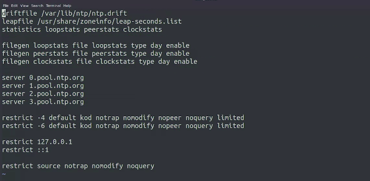</a>
					</p>
				* This is the configuration values by the NTP service
				* It's currently using a bunch of servers from `ntp.org`
					* But instead of those servers, we want to try out the NTP servers provided by Google
					* These are called `time1.google.com`, and then time2, time3, and time4
						<p align="center">
						  <a href="javascript:void(0)" rel="noopener">
							 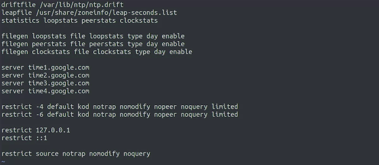</a>
						</p>
					* We have made the changes, now we rerun our Puppet rules with the new configuration file
							<p align="center">
							  <a href="javascript:void(0)" rel="noopener">
								 </a>
							</p>
						* Puppet updated the configuration file with the new contents and then refresh the service, so it loaded the config
	* __We write resource types in lowercase when declaring them, but capitalize them when referring to them from another resource's attributes__

> When declaring resources initially, we type the resource type in lowercase. When we reference a resource relationship from another file, we capitalize the resource name being referenced

### Organizing Your Puppet Modules

* In any configuration management deployment, there's usually a lot of different things to manage
	* We might want to
		1. install some packages
		1. copy some configuration files
		1. start some services
		1. schedule some periodic tasks
		1. make sure some users and groups are created and have access to specific devices
		1. maybe execute a few commands that aren't provided by existing resources
	* On top of that, there might be different configurations applied to the different computers in the fleet
	* For Example
		* Workstations and laptops might include resources that aren't used on servers
		* Each distinct type of server will need its own specific setup
	* We need to organize all these resources and information in a way that helps us maintain them long-term
		* This means __grouping related resources__, giving the groups good names, and making sure that the organization will make sense to new users
* __Modules__
	* In puppet, we organize our manifests into modules
	* A __Module__ is a collection of manifests and associated data
	* We can put any resource we want into a module, but to keep our configuration management organized, we'll group things together under a sensible topic
		* For Example
			1. We could have a module for everything related to monitoring the computer's health
			1. Another one for setting up the network stack
			1. Yet another one for configuring a web serving application
	* The module ship the manifest in the associated data, but __how is this organized?__
		* All manifests gets stored in a directory called __manifests__
		* The rest of the data is stored in different directories depending on what it does
		* The files directory includes files that are copied into the client machines without any changes, like the `ntp.conf` file
		* The __template directory__ includes files that are preprocessed before they've been copied into the client machines
			* These templates can include values that get replaced after calculating the manifests, or sections that are only present if certain conditions are valid
							<p align="center">
							  <a href="javascript:void(0)" rel="noopener">
								 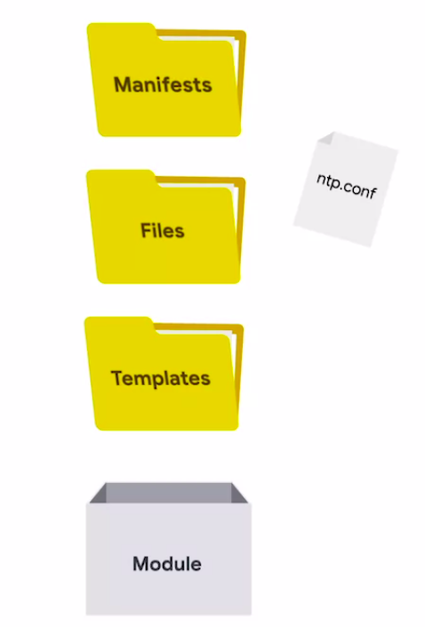</a>
							</p>
	* We can start with the simple module that just has one manifest in the Manifest directory
		* This file should be called __`init.pp`__ and it should define a class with the same name as the module that you're creating
		* Then any files that your rules use need to be stored in the files or templates directories depending on whether you copy them directly or need to preprocess them
		* For example
			* This is how the NTP class looks like when turned into a module
							<p align="center">
							  <a href="javascript:void(0)" rel="noopener">
								 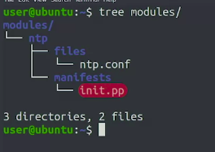</a>
							</p>
				* There's an `init.pp` file, which contains the NTP classes, and the `ntp.conf` file that gets deployed onto the machine is now stored in the files directory
				* Modules like these can look pretty much the same no matter who's using them
	* Let's install the Apache module provided by Puppet Labs to check out how this works
		* To install on ubuntu use: `sudo apt install puppet-module-puppetlabs-apache`
		* We'll change into the directory where the module files are stored and list its contents
							<p align="center">
							  <a href="javascript:void(0)" rel="noopener">
								 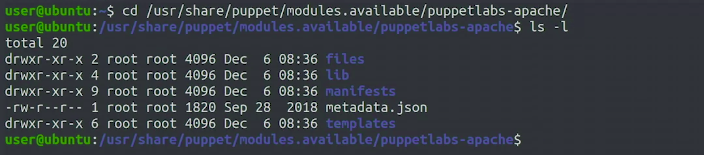</a>
							</p>
			* We see the files, manifests, and templates directories
			* On top of that, there's a __lib directory__ that adds functions and fact to the ones already shipped by puppet
			* The `metadata.json` file includes some additional data about the module we just installed, like which versions of which operating systems it's compatible with
			* Content of manifest directory
							<p align="center">
							  <a href="javascript:void(0)" rel="noopener">
								 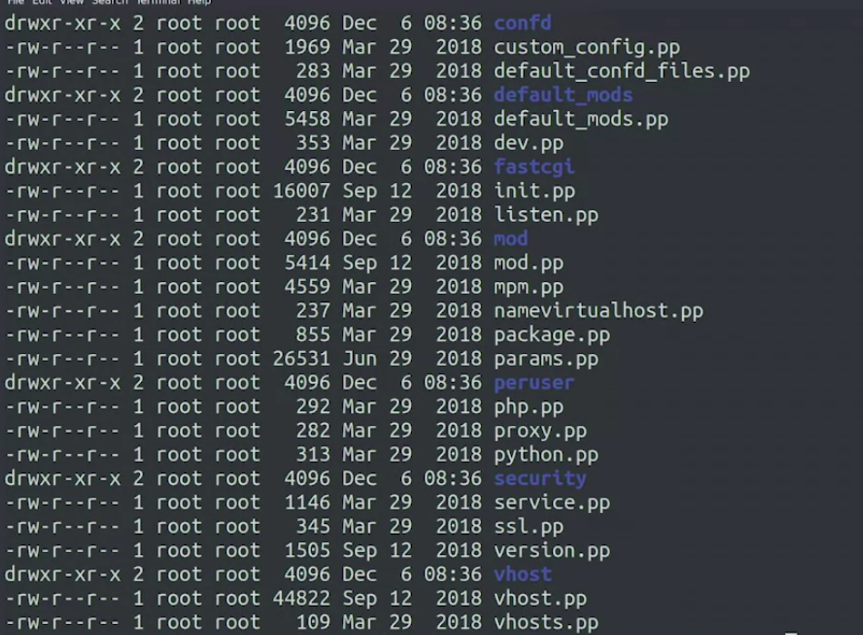</a>
							</p>
				* That's a lot of files, like how we split the different things that we want to manage into separate modules
				* We can also split each separate functionality that we want to configure into separate manifests
					* This helps us organize our code when we make changes to it
				* See how this directory also contains its own `init.pp`
					* this manifest is special
					* It needs to always be present because it's the first one that's read by puppet when a module gets included
	* __How do we include a module?__
				<p align="center">
				  <a href="javascript:void(0)" rel="noopener">
					 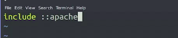</a>
				</p>
		* Here, we're telling Puppet to include the Apache module
		* The double colon before the module name, let's puppet know that this is a global module
		* Lets apply this
				<p align="center">
				  <a href="javascript:void(0)" rel="noopener">
					 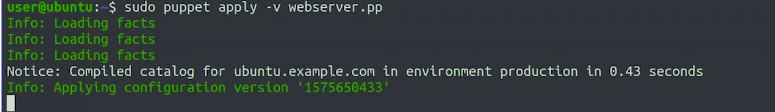</a>
				</p>
			* By including the module, we got puppet to apply all the rules run by default in the module

> Metadata is data about data, and in this case, often takes the form of installation and compatibility information
#
> New functions added after installing a new module can be found in the __lib folder__ in the directory of the new module
#
> The catalog is the list of rules for each individual system generated once the server has evaluated all variables, conditionals, and functionals in the manifest and then compared them with facts for each system

## Deploying Puppet to Clients

### Puppet Nodes

* When managing fleets of computers, we usually want some rules to apply to every computer, and other rules to apply only to a subset of systems
* Let's say you're managing all your servers with Puppet
	* You might want to install a basic set of tools on all of them, but only install the packages for serving web pages in your web servers
	* And only install the packages for sending and receiving email in your mail servers
* There are different ways to do this
	1. We can conditionally apply some rules using facts from the machines
	1. Another way to apply different rules to different systems is to use separate node definitions
* A __Node__ is any system where we can run a Puppet agent
	* It could be a __physical workstation__, a __server__, a __virtual machine__, or even a __network router__, as long as it has a Puppet agent and can apply the given rules
* So we can set up Puppet to give some basic rules to all the nodes, but then apply some specific rules to the nodes that we want to be different
	* For Example
		1. When setting up Puppet, we usually have a default node definition that lists the classes that should be included for all the nodes
			* Here, the default node is including two classes, the __sudo class__ and the __ntp class__
			* For the ntp class, we're setting an additional servers parameter that lists the servers we can use to get the network time
					<p align="center">
					  <a href="javascript:void(0)" rel="noopener">
						 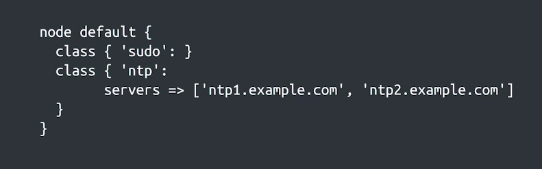</a>
					</p>
			* when defining a node, you can include a class by just using its name if there's no additional settings
			* include the class and set additional parameters if necessary
		1. What if you want some settings to only apply to some specific nodes?
			* You can do that by adding more node definitions that list the classes that you want them to include
					<p align="center">
					  <a href="javascript:void(0)" rel="noopener">
						 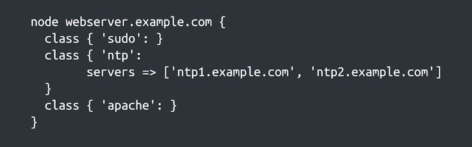</a>
					</p>
			* We can see here that specific nodes in the fleet are identified by their **FQDN**s, or __fully qualified domain names__
				* In this case, we have the node definition for a host called `webserver.example.com`
				* For this node, we're including the same sudo and ntp classes as before, and we're adding the apache class on top
				* We're listing the same classes because the classes included in the default node definition are only applied to the nodes that don't have an explicit entry
					* In other words, when a node requests which rules it should apply, Puppet will look at the node definitions, figure out which one matches the node's __FQDN__, and then give only those rules
				* To avoid repeating the inclusion of all the common classes, we might define a base class that does the work of including all the classes that are common to all node types
* The node definitions are typically stored in a file called __`site.pp`__
	* which isn't part of any module
	* Instead, it just defines what classes will be included for what nodes

### Puppet's Certificate Infrastructure

* In typical Puppet deployments, all managed machines and the fleet connect to a Puppet server
	* The client send their facts to the server, and the server then processes the manifests, generates the corresponding catalog, and sends it back to the clients who apply it locally
					<p align="center">
					  <a href="javascript:void(0)" rel="noopener">
						 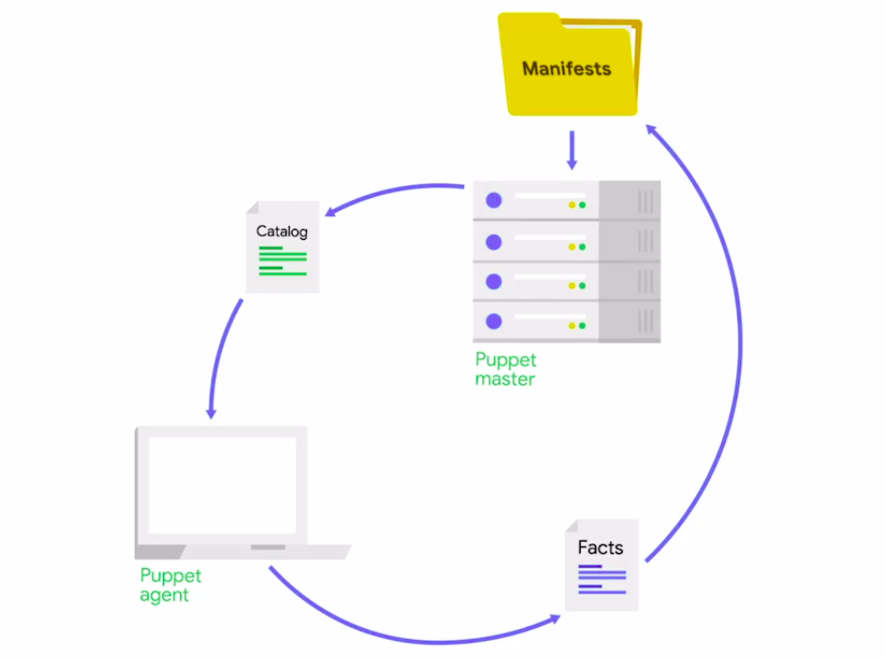</a>
					</p>
* We can apply different rules to different nodes depending on their names
	* The client send their name to the server when they connect
		* but how can the server trust that a client is really who he claims to be?
			* Puppet uses __public key infrastructure__, or __PKI__, to establish secure connections between the server and the clients
			* There's a bunch of different types of public key technologies
				* The one used by Puppet is __secure sockets layer__ or __SSL__
					* This is the same __technology__ used for encrypting transmissions over __HTTPS__
	* The clients use this infrastructure to check the server's identity, and the server uses it to check the client's identity, and all communication is done over an encrypted channel that uses these identities so it can't be intercepted by other parties
* How does this work?
	* Each machine involved has a pair of keys related to each other, a __private key__ and a __public key__
					<p align="center">
					  <a href="javascript:void(0)" rel="noopener">
						 </a>
					</p>
		* The __private key__ is secret, only known to that specific machine
		* The __public key__ is shared with other machines involved
					<p align="center">
					  <a href="javascript:void(0)" rel="noopener">
						 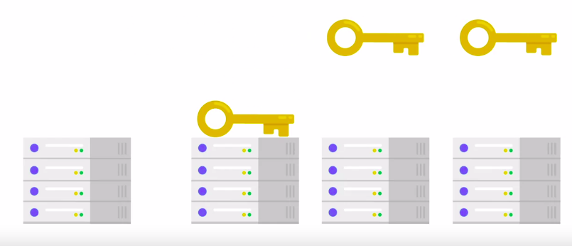</a>
					</p>
	* Machines can then use the standardized process to validate the identity of any other machine
	* The sender signs a message using the private key and the receiver validates the signature using the corresponding public key
* How do machines know which public keys to trust?
	* This is where a certificate authority, or CA comes in
	* The CA verifies the identity of the machine and then creates a certificate stating that the public key goes with that machine
	* After that, other machines can rely on that certificate to know that they can trust the public key, since it means the machine's identity has been verified
* Puppet comes with its own certificate authority, which can be used to create certificates for each clients
	1. So you can use this one
	1. Or if your company already has a CA that validates the identity of the machines in your fleet
		* you can integrate it with Puppet, so you only validate the identities once
* Now, let's assume you're using the baked-in certificate infrastructure and dive into how this process works
	* When a node checks into the Puppet master for the first time, it requests the certificate
	* The Puppet master looks at this request and if it can verify the nodes identity, it creates a certificate for that node
	* The system administrator can check the identity manually or use a process that does this automatically using additional information about the machines to verify their identity
	* When the agent node picks up this certificate, it knows it can trust the Puppet master, and the node can use the certificate from then on to identify itself when requesting a catalog
* Why do we care so much about the identity of the nodes?
	* There are bunch of reasons for this
		1. First, Puppet rules can sometimes include confidential information that you don't want to fall in the wrong hands
		1. But even if none of the rules hold confidential info, you want to be sure that the machine you're setting up as your web server really is your web server and not a rogue machine that just claims to have the same name
		1. All sorts of things could go wrong if random computers start popping up in your network with the wrong settings
	* If you're creating a test deployment to try out how Puppet rules get applied, and so you're only managing tests machines, you can configure Puppet to automatically sign all requests
		* but you should never do this for real computers being used by real users
* When starting out with Puppet, it's common to use the manual signing approach
	* In this case, when the node connects to the master, it will generate a certificate request, which we'll go into a queue in the Puppet master machine
	* You'll then need to verify that the machine's identity is correct and the baked-in CA will issue the corresponding certificate
* When fleet is large manual signing approach does not work very well
	* Instead, you'll want to write a script that verifies the identity of the machines automatically for you
		* One way to do this is by copying a unique piece of information into the machines when they get provisioned and then use this pre-shared data as part of the certificate request
		* That way, your script can verify that the machines are who they claim to be without involving any humans
		
> The CA either queues a certificate request for manual validation, or uses pre-shared data to verify before sending the certificate to the agent.

### Setting up Puppet Clients and Servers

* Since this is a test deployment to demonstrate Puppet, we'll configure it to automatically sign the certificate requests of the nodes we add
	```shell
	>>> sudo puppet config --section master set autosign true
	```
* __NOTE:__ if we were deploying this to real computers, we'd have to manually sign the requests or implement a proper validating script
* Now we will setup a web server and install puppet init
	* Now we need to configure it to talk to the Puppet server that we're running on the other machine
	* To do this, we will
		```shell
		>>> sudo puppet config set server ubuntu.example.com
		```
* Now that we've configured the server, we can test the connection to the Puppet master by using the Puppet agent command
	```shell
	>>> sudo puppet agent -v --test # -v as before to get verbose output, and --test to do a test run
	```
	<p align="center">
	  <a href="javascript:void(0)" rel="noopener">
		 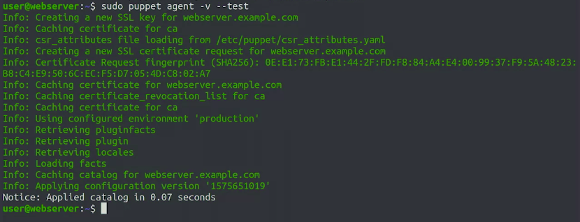</a>
	</p>
	* Puppet tells us everything it did
		* It first created an SSL key for the machine
		* It then read a bunch of information from the machine and used this to create a certificate request
		* The agent shows us the fingerprint of the certificate requested
			* If we were using manual signing, we could use this fingerprint to verify that the request and the server matches the one generated on the machine
		* The certificate was then generated on our puppet master
			* We don't see any entries for that because it happened on the other computer.
		* But we see that this computer received a certificate and stored it locally
		* Once the certificate exchange completed, the agent retrieved all the information from the machine and sent it to the master
		* In exchange, it got back a catalog and applied it
			* The catalog applied almost immediately because we haven't actually configured any rules to be applied to our clients
* Now we will create some node definitions
	* Node definitions are stored in a manifest file called site.pp, which is stored at the root of the nodes environment
	* Our client is trying to access the production environment
		* So the file that we need to create will be located at `/etc/puppet/code/environments/production/mainfest/`,  and it will be called `site.pp`
			```shell
			>>> vim /etc/puppet/code/environments/production/mainfest/site.pp
			```
			* In this file, we'll create a couple of node definitions
			* We want to install Apache in our web server, so we'll create a node definition for the web server with the Apache class and node parameters
			* we'll also add a default node definition
				* We'll keep it empty for now. We can add more classes in the future
					```ruby
					>>> node webserver.example.com{
					>>> 	class {'apache':}
					>>> }
					>>> 
					>>> node default {}
					```
			* Save this and run the Puppet agent on our web server machine again
				```shell
				>>> sudo puppet agent -v --test
				```
				<p align="center">
				  <a href="javascript:void(0)" rel="noopener">
					 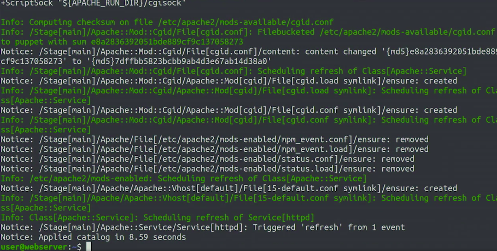</a>
				</p>
			* This time, the Puppet agent connected to the Puppet master and got a catalog that told it to install and configure the Apache package
			* This included setting up a bunch of different services
* What if we want to keep Puppet running automatically
	* That way, if we make changes to the configuration, clients will automatically apply those changes without us having to do any manual steps
	* So to do that, we'll use the `systemctl` command, which lets us control the services that are enabled when the machine starts and those that are currently running
	* So we'll first tell the system CTL to enable the puppet service so that the agent gets started whenever the machine reboots
		```shell
		>>> sudo systemctl enable puppet
		```
		<p align="center">
		  <a href="javascript:void(0)" rel="noopener">
			 </a>
		</p>
	* Then we'll tell system CTL to start the puppet service so that it starts running
	* Last step, we'll ask systems CTL for the status of the Puppet service to check that it's actually running
		```shell
		>>> sudo systemctl start puppet
		>>> sudo systemctl status puppet
		```
		<p align="center">
		  <a href="javascript:void(0)" rel="noopener">
			 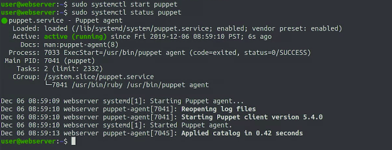</a>
		</p>
	* The Puppet agent will keep regularly checking in with the master and ask if there are any changes that need to be applied to the machine
* We use the configuration we set in the Puppet master to manage the installation and configuration of software in our web server, and we set up the Puppet agent in the web server to keep running so that the configuration stays up to date

> A fully qualified domain name (FQDN) is the unabbreviated name for a particular computer, or server. There are two elements of the FQDN: the hostname and the domain name
#
> A FQDN is a complete domain name for a specific machine that contains both the hostname and the domain name
#
> Templates are documents that combine code, system facts, and text to render a configuration output fitting predefined rules
#
> Puppet uses an Secure Sockets Layer (SSL) Public Key Infrastructure to authenticate both nodes and masters


## Updating Deployments

### Modifying and Testing Manifests

* When we change the manifest modifying a setting that's already managed by puppet
	* Puppet applies this change to the notes, the puppet agent does whatever is needed to bring the nodes to the new desired state
	* so you can make a small change in your manifests and have that modify all the machines in your fleet
* It's pretty common for IT specialist working on configuration management to test out new rules on their machines by simply forcing the machine to apply the manifest they want to test
* How to test rules (manifests)
	* A simple first step is to use the `puppet parser validate` command that checks that the syntax of the manifests is correct
	* On top of that we can also run the rules using the `--noop` parameter the name comes from no operations
		* it makes puppet simulate what it would do without actually doing it
	* You can look at the list of actions that it would take and check that they're exactly what you wanted puppet to do
	* But if the change is complex, it's likely that we'll miss something important when looking at the planned actions
		* another option you could use is having test machines that are used only for testing out changes
		* You can apply the rules there and after a puppet has run check that everything's working correctly
* How can we automate Testing process
	* Puppet also lets us test our manifests automatically by using __`rspec tests`__
	* In these tests
		* We can set the facts involved different values and check that the catalog ends up stating what we wanted it to
	* Example
		* Here we're setting the is virtual fact to false
		* then we asked the test infrastructure to verify that the gks you package is included with the insurer parameter set to latest tests
			<p align="center">
			  <a href="javascript:void(0)" rel="noopener">
				 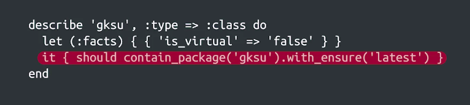</a>
			</p>
		* Test like this one can be a useful way to check that our catalog is written correctly
		* They can be super helpful when a rule is used a lot of facts that interact with each other and we want to check that the result is actually what we intended
		* We can write a bunch of these tests and run them automatically whenever there is a change to the rules
			* this way we can be sure that the rules stay valid and know that the new changes didn't break the old rules
* How can we verify that these rules actually have the effects we want like enabling the corporate website or setting up a strict firewall
	* We need to apply the rules on the nodes and check that the result is correct
	* We can automate this process to,
		* to do this we can use the set of test machines where we first apply the catalog
		* then use scripts to check that the machines are behaving correctly

> The puppet parser validate command checks the syntax of the manifest to make sure it's correct

### Safely Rolling out Changes and Validating Them

* In an infrastructure context, __production__ is the parts of the infrastructure where a service is executed and served to its users
	* If you host a website, the servers that deliver the website content to the users are the production servers
	* Inside your company, the servers that validate users passwords are the production authentication servers
* Making changes to the production servers can be tricky because if something goes wrong, the service can go down
* How can we roll out changes safely?
	* The key is to always run them through a test environment first
	* The test environment should have one or more machines running the exact same configuration as the production environment
	* But these machines aren't actually serving any users of the service
	* This way, there's a problem when deploying the changes should be able to fix it without any actual users seeing it.
* Puppet has environments picked in
	* Each environment has its own directory with its own set of manifests and modules
	* Puppet environments lets us fully isolate the configurations that the agency depending on what environment they're running
	* This isn't just what nodes install which modules, it's also the whole contents of the modules
	* For example
		* We can use this to try out a whole new version of the Apache module for the machines in the test environment while still using the old version for the production environments
	* You can define as many environments as you need
		* For example
			1. you could have a development environment for IT specialists to try out new Puppet rules before they even reach the test environment
			1. say you're developing a very tricky new feature for your system and you don't know when it'll be ready
				* You could have an environment for testing just that specific feature
* Let's assume that you have a bunch of changes ready to roll out. You'll usually push them to the machines in the test environment first and check that everything works well there
	* This can include both manual verification and automated checking
	* Say the changes worked fine in the test environment
	* how do you roll them out to the other machines in your fleets?
		* You might be tempted to just apply the changes to all the machines and be done with it
		* But pushing changes to every machine at the same time is usually not a great idea
		* It's always possible that we missed some special case when preparing the change which wasn't part of our test environment
			* suddenly, half our fleet is offline. So instead of pushing the changes to all nodes, we usually do it in batches
		* There's a bunch of ways you can do this depending on how your fleet is arranged
			* You could have some machines with the fact that marks them as early adopters or canaries
				* Like the canaries that coal miners used to detect toxic gases in the mines, these nodes detect potential issues before they reach the other computers
			* So you could push the changes to the canaries on one day, check that everything's working fine, and then deploy them to the rest of the fleet on the next day
			* That way, if there's an issue with the changes that wasn't caught in testing, only a subset of the users might see it
			* As soon as you get notified of the problem, you can roll it back and avoid it hitting the rest of the fleet
* It's a good idea for these changes to be small and self-contained
	* That way, if something breaks, it's much easier to figure out where the problem was
	* Example
		* Imagine you're trying to push six months worth of changes to your fleet of computers
		* When you push this to the machines in the test environment, you discover that they stop responding all together
		* You now need to come through all the changes that were bundled together to try to find out which one is causing the problem
	* Instead, you could aim to roll out your changes every one or two weeks
	* This would mean that whenever a problem is detected, there's only a small list of changes to go through to figure out the culprit

> Environments in Puppet are used to isolate software in development from software being served to end users
#
> No Operations mode makes Puppet simulate what it would do without actually doing it
> In order to perform No Operations simulations, we must use the --noop parameter when running the rules
#
> We can test our manifests automatically by using rspec tests. In these tests, we can verify resources exist and have attributes set to specific values
#
> To test automatically, we need to run rspec tests, and fix any errors in the manifest until the RSpec tests pass
#
> Using the puppet parser validate command is the simplest way to check that the syntax of the manifest is correct

