Configuration Management and the Cloud
======================================

by Google

# Module 3
#
## Title: Automation in the Cloud

## Cloud Computing

### Cloud Services Overview

* When we say that a service is running in the Cloud, it means that the service is running somewhere else either in a data center or in other remote servers that we can reach over the Internet
	* These data centers house a large variety of machines, different types of machines are used for different services
	* For example
		1. Some machines may have local solid-state drive or SSD, for increased performance while others may rely on virtual drives mounted over the network to lower costs
* Cloud providers typically offer a bunch of different service types, the ones used most by users are in the **S**oftware **a**s **a** **S**ervice (**SaaS**) category
	* **S**oftware **a**s **a** **S**ervice or **SaaS**, is when a Cloud provider delivers an entire application or program to the customer
	* If you choose 
		1. a Cloud e-mail solution like Gmail
		1. a Cloud storage solution like Dropbox
		1. a Cloud productivity suite like Microsoft Office 365, there are only a small number of options for you to select or customize
	* The Cloud provider manages everything related to the service for you including deciding where it's hosted, ensuring the service has enough capacity to serve your needs, performing backups frequently and reliably, and a lot more
	* There's a lot of software being offered as a service by many different Cloud providers or other Internet companies
* **P**latform **a**s **a** **S**ervice or **PaaS**, is when a Cloud provider offers a preconfigured platform to the customer
	* Example
		1. Say you need an SQL database to store some of your applications data, you could choose to host the database in your own hardware
			* To do this, you'd need to install an operating system on that computer and then install the SQL software on top of the chosen OS
			* This requires a basic understanding of all of these different pieces just to get the database running
				* There's a bunch of things that could go wrong and even if you can eventually solve all of them, it can take awhile
			* Instead, you could decide to use a Cloud provider that offers an SQL database as a service, that way you can just focus on writing SQL queries and using the platform, and let the Cloud provider take care of the rest
* **I**nfrastructure **a**s **a** **S**ervice or **IaaS**, is when a Cloud provider supplies only the bare-bones computing experience
	* If you need a high level of control over the software you're running and how it interacts with other pieces in your system, you might want to choose Infrastructure as a Service
	* this means a virtual machine environment and any networking components needed to connect virtual machines
	* the Cloud provider won't care what you're using the VMs for
		* You could use them to host
			1. a web server
			1. a mail server
			1. your own SQL database with your own configuration settings, etc
	* Running your IT infrastructure on the Cloud provider's IaaS offering is a very popular choice
	* Some IaaS products include: Amazon's EC2, Google Compute Engine, and Microsoft Azure Compute
	* Now no matter the service model and the provider you use, when you set up Cloud resources you'll need to consider regions
* __Region__
	* A __region__ is a geographical location containing a number of data centers, regions contain zones and zones can contain one or more physical data centers
	* If one of them fails for some reason, the others are still available and services can be migrated without notably affecting users
	* Large Cloud providers usually offer their services in lots of different regions around the world
		* Generally, the region and zone you select should be closest to your users, the further your users are from the physical data center the more latency they may experience
	* Latency isn't the only factor to take into account when selecting a region or zone, some organizations require their data to be stored in specific cities or countries for legal or policy reasons

> Infrastructure as a Service (IaaS) provides users with the bare minimum needed to utilize a server’s computational resources, such as a virtual machine. It is the user's responsibility to configure everything else

### Scaling in the Cloud

* __Capacity__ is how much the service can deliver
	* The available capacity is tied to the number and size of servers involved
	* We get more capacity by adding more servers or replacing them with bigger servers
	* The way we measure the capacity of a system depends on what the system is doing
		1. If we're storing data, we might care about the total disk space available
		1. If we have a web server responding to queries from external users
			1. we might care about the number of queries that can be answered in a second which is called __queries per second__ or __QPS__
			1. maybe the total bandwidth served in an hour
	* We can measure capacity in other fun ways like
		1. the number of cat videos served in an hour
		1. the number of digits of pi a system can calculates
	* Our capacity needs can change over time
		* Example
			1. Say you're hosting an e-commerce site that needs a hundred servers to meet user demands
				* As the service becomes more popular, demand might grow and you'll need to increase the available capacity
				* Eventually, the system could need a thousand servers to meet user demands
				* This capacity change is called __scaling__
* __Scaling__
	* __Upscaling__ when we increase our capacity
	* __Downscaling__ when we decrease it
		* This could happen for example if the demand for a product decreased or if the system was improved to need fewer resources
	* There are a couple of different ways that we can scale our service in the Cloud
		1. __horizontally__
			* To scale a deployment horizontally, we add more nodes into the pool that's part of a specific service
					

					  
					

			* Say your web service is using Apache to serve web pages
				* By default, Apache is configured to support a 150 concurrent connections
					

					  <a href="javascript:void(0)" rel="noopener">
						 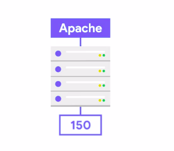</a>
					

				* If you want to be able to serve 1,500 connections at the same time, you can deploy 10 Apache web servers and distribute the load across them
					

					  <a href="javascript:void(0)" rel="noopener">
						 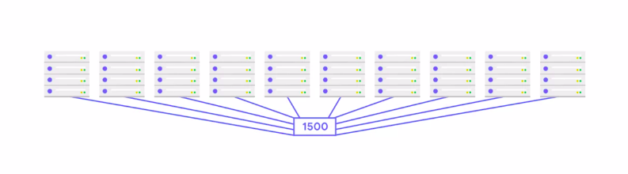</a>
					

				* This is called __horizontal scaling__
					* You add more servers to increase your capacity
					* If the traffic goes up you could just add more servers to keep up with it
		1. __vertically__
			* It means you're making your nodes bigger
				* When we say bigger here we're talking about the resources assigned to the nodes like memories, CPU, and disk space
			* For example
				1. a database server with a 100 gigabytes of disk space can store more data than with only 10 gigabytes of space
						

						  <a href="javascript:void(0)" rel="noopener">
							 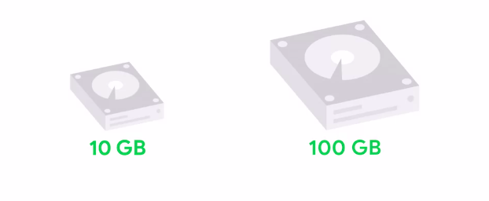</a>
						

					* To scale this deployment we can just add a bigger disk to the machine and the same idea works for a CPU and memory too
				1. Say you have a caching server and you notice it's using 95 percent of the available memory
					* You can deal with that by adding more memory to the node
						

						  <a href="javascript:void(0)" rel="noopener">
							 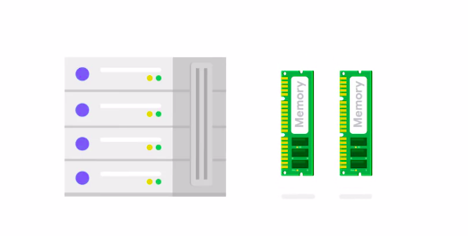</a>
						

	* Depending on our deployment and our needs, we might need to scale both horizontally and vertically to scale the capacity of our service
	* In other words, adding more and bigger nodes to our pool
* __Automatic Scaling__
	* This service offered by the Cloud provider will use metrics to automatically increase or decrease the capacity of the system
	* Example
		1. Say you have a system that currently has the capacity to serve 1,000 cat videos per minutes
			* If the demand for these videos increases to 10,000 per minute and it will, the software in-charge of the automatic scaling will add resources and increase the overall capacity to meet this demand
			* When the users stop watching cat videos, the automation will remove any unused resources, so the operating costs stay small
	* But make sure you set a reasonable quotas for your autoscaling systems. Otherwise, that viral video of a cute cat wearing a hat might surprise you with a very uncute big bill from your Cloud provider
* __Manual Scaling__
	* This means that the changes are controlled by humans instead of software
	* Manual scaling has its pros and cons too
	* When the Cloud deployment isn't very complex, it's usually easier for smaller organizations to use manual scaling practices
	* Example
		1. Say your company currently has a single mail server and you know that you'll want to have another one in six months. In that case, there's no need to overcomplicate that system with an autoscaler
			* You could simply add the extra server sometime along the way
	* The trade-off here is that without good monitoring or alerting, a system without autoscaling technologies might suffer from unexpected increases in demand
	* Example
		1. If you're using manual scaling for a service that becomes popular and demand grows quickly, you might not be able to increase the capacity quickly enough
	* This can store up lots of problems ranging from poor performance to an actual outage

### Evaluating the Cloud

* When choosing to use __software as a service__, we're basically giving the provider complete control of how the application runs
	* We have a limited amount of settings that we can change, but we don't need to worry about making the system work
	* This can be a great option when the software provided fulfills all of our needs and we'd rather just focus on using the software instead
	* there's only a limited amount of applications being offered in such a prepackaged way
* If we need to create our own applications, we can use __platform as a service__
	* With this option, we're in charge of the code, but we aren't in control of running the application
* We can choose __infrastructure as a service__, where we can still keep a high level of control
	* We decide the operating system that runs on the virtual machines, the applications that are installed on it, and so on
	* We'll still depend on the vendor for other aspects of the deployment, like the network configuration or the services availability
	* If something does break, you might need to get support from the vendor to fix the problem
* So when choosing a cloud provider, it's important to know what kind of support is available and select the one that fits your needs
* It does sounds strange to give away your control over the hardware, and the network, and the overall infrastructure
	* But, in a way it's pretty great to not have to worry about maintaining the machines that are running our services
	* It means we can treat the servers executing the workloads as a commodity, instead of special snowflakes
* When selecting which provider to use, it's important that you check how they're keeping your __instances__ and your __data__ *__secure__*
	* There are a bunch of certifications like SOC 1, ISO 27001, and other industry recognized credentials that you can look for to verify that your provider has invested in security
* We should always use reasonable judgment to protect the machines that we deploy ,whether that's on physical server is running on-premise or on virtual machines in the Cloud
* It's also important to keep in mind that security systems can be expensive to implement correctly
	* Some highly sensitive deployments might warrant specialized security procedures, like multi-factor authentication, encrypted file systems, or public key cryptography
		* But these processes can also be expensive to implement
* Other reasons for having doubts about cloud providers
	1. you might be worried of where your data is going to be stored
	1. you might fear that the support offered won't satisfy your needs
* It's important that you carefully read the terms of service to understand the conditions and figure out if the service offered will satisfy your needs

> Cloud services provide many advantages, such as outsourcing support and maintenance, simplifying configuration management, and letting the provider take care of security
#
> Cloud services provide many advantages, including simplifying configuration management, outsourcing support and maintenance, and letting the provider take care of security
#
> Cloud services provide several advantages, like putting the provider in charge of security

### Migrating to the Cloud

* When we use __Infrastructure as a Service__ or __IaaS__, we deploy our services using virtual machines running on the Cloud providers infrastructure
	* We have a lot of control over how the infrastructure is designed which can be super useful
	* For example,
		* we can decide which of the many available machine types to use and what kind of storage to attach to them
	* __IaaS__ is especially useful to administrators using a __lift and shift__ strategy
		* Say you work at a small organization that's expanding
			* As the company grows, physical space for employees; desks, ping pong tables, and printers becomes scarce
			* Eventually, the whole office might need to move to a larger space
				* This means moving not just the desks and printers, but also any servers running on-premise
				* If physical servers need to be moved, you might need to take a server from the old office, turn it off during a maintenance window, load it onto a truck, and physically drive it to the new location
				* This could be the new office or maybe even a small data center
			* So you're literally lifting the server and moving it to a new location, that's where the lift in lift and shift comes from
	* When migrating to the Cloud, the process is somewhat similar
		* But instead of moving the physical server in the back of a truck, you migrate your physical servers running on-premise to a virtual machine running in the Cloud
		* In this case, you're shifting from one way of running your servers to another
	* The key thing to note with both approaches, is that the servers core configurations stay the same
		* It's the same software that needs to be installed on the machine to provide its functionality, no matter if the server is hosted physically on-site or virtually in the Cloud
	* If you've already been using configuration management to deploy and configure your physical servers, moving to a Cloud setup can be pretty easy
		* You just have to apply the same configuration to the VMs that are running in the Cloud and you'll have replicated the setup
* On the flip side, using this strategy means that you still have to install and configure the applications yourself
	* You need to make sure that both the OS and the software stay up to date, that no functionality breaks when they get updated, and a bunch of other things depending on which specific application the server is running
	* One alternative in this case is using __Platform as a Service__ or __PaaS__
		* This is well-suited for when you have a specific infrastructure requirement, but you don't want to be involved in the day-to-day management of the platform
		* Example
			1. example of Platform as a Service are managed web applications
				* When using this service, you only have to care about writing the code for the web app
					* You don't need to care about the framework for running it
				* This can accelerate development because developers don't have to spend time managing the platform and can just focus on writing code
		* Some popular managed web application platforms include
			1. Amazon Elastic Beanstalk
			1. Microsoft App Service
			1. Google App Engine
		* While these platforms are very similar, they aren't fully compatible
			* So migrating from an on-premise framework and switching between vendors will require some code changes
* __Containers__
	* Containers are applications that are packaged together with their configuration and dependencies
	* This allows the applications to run in the same way no matter the environment used to run them
		* In other words, if you have a container running an application, you can deploy it to your on-premise server, to a Cloud provider, or a different Cloud provider
	* Whichever you choose, it will always run in the same way
	* This makes migrating from one platform to the other super easy
* Types of Clouds available
	1. public Clouds
		* the Cloud services provided to you by a third party
		* It's called public because Cloud providers offer services to the public
	1. private Clouds
		* A private Cloud is when your company owns the services and the rest of your infrastructure, whether that's on-site or in a remote data center
		* It's private because it's just for your company, like having your own Cloud in the sky
	1. hybrid Clouds
		* A hybrid Cloud is a mixture of both public and private Clouds
		* In this scenario, some workloads are run on servers owned by your company, while others are run on servers owned by a third party
		* The trick to making the most of the hybrid Cloud is ensuring that everything is integrated smoothly
		* This way, you can access, migrate, and manage data seamlessly no matter where it's hosted
	1. multi-Clouds
		* multi-Cloud is a mixture of public and/or private Clouds across vendors
		* For example, a multi-Cloud deployment may include servers hosted with Google, Amazon, Microsoft, and on-premise
		* A hybrid Cloud is simply a type of multi-Cloud, but the key difference is that multi-Clouds will use several vendors, sometimes in addition to on-site services
		* Using multi-Clouds can be expensive, but it gives you extra protection
			* If one of your providers has a problem, your service can keep running on the infrastructure provided by a different provider

> What does the phrase __lift and shift__ refer to? \
When we migrate from traditional server configurations to the Cloud, we __lift__ the current configuration and __shift__ it to a virtual machine
#
> A public cloud offers services to the general public, often as SaaS (Software as a Service) offerings
#
> A container is an OS- and hardware-independent environment that allows for easy migration and compatibility
#
> Google App Engine is a Platform as a Service (PaaS) product that offers access to Google's flexible hosting and Tier 1 Internet service for Web app developers and enterprises
#
> AWS Elastic Beanstalk is an easy-to-use PaaS service for deploying and scaling web applications
#
> Microsoft Azure App Service enables you to build and host web apps, mobile back ends, and RESTful APIs in the programming language of your choice without having to manage infrastructure
#
> A private cloud deployment is one that is fully owned and operated by a single company or entity
#
> Vertical scaling is a form of upscaling, but upscaling can also be horizontal

## Managing Instances in the Cloud

### Spinning up VMs in the Cloud

* All Cloud providers give you a console that lets you manage the services that you're using
	* This console includes pointers to a lot of different services that the providers offer
* When you want to create a VM running in the Cloud, there are a bunch of parameters that you need to set
	* These parameters are used by the Cloud infrastructure to spin up the machine with the settings that we want
		1. choosing the name assigned to the instance
			* This name will later let you identify the instance if you want to connect to it, modify it, or even delete it
		1. choose the region and zone where the instance is running
			* you'll generally want to choose a region that's close to your users so that you provide better performance
		1. need to select is the machine type for your VM
			* Cloud providers allow users to configure the characteristics of their virtual machines to fit their needs
			* This means selecting how many processing units, or virtual CPUs, and how much memory the virtual machine will be allocated
* As a sysadmin, you may need to decide between costs and processing power to fit the needs of your organization
	* When setting up instances like these, it's a good idea to start small and scale as needed
* On top of the CPU and memory available, you'll also need to select the boot disk that the VM will use
	* Each virtual machine running in the Cloud has an associated disk that contains the operating system it runs and some extra disk space
	* When you create the VM, you select both how much space you want to allocate for the virtual disk and what operating system you want the machine to run
* To create these resources, we can use the web interface or the command line interface
	* The web UI can be very useful for quickly inspecting the parameters that we need to set
	* The UI will let us compare the different options available and even show us an estimation of how much money our selected VM would cost per month
	* This is great for experimenting, but it doesn't scale well if we need to quickly create a bunch of machines or if we want to automate the creation
* In cases where we need to quickly create a bunch of machines or if we want to automate the creation
	* we'll use the command line interface, which lets us specify what we want once, and then use the same parameters many times
		* Using the command line interface lets us create, modify, and even delete virtual machines from our scripts
* __Reference images__ store the contents of a machine in a reusable format
* __Templating__ is the process of capturing all of the system configuration to let us create VMS in a repeatable way
* That exact format of the reference image will depend on the vendor
	* But often, the result is a file called a disk image
* A __disk image__ is a snapshot of a virtual machine's disk at a given point in time
* Good templating software lets you copy an entire virtual machine and use that copy to generate new ones
* Depending on the software, the disk image might not be an exact copy of the original machine because some machine data changes, like the hostname and IP address
	* But it will have the data that we need to make it reusable on lots of virtual machines
	* This can be super helpful if we want to build a cluster of 10,000 machines which all have identical software

> A disk image is a snapshot of a virtual machine’s disk, and is an exact copy of the virtual machine at the time of the snapshot

### Creating a New VM Using the GCP Web UI

* THIS IS A DEMO VIDEO FOR CREATING VM. NO NOTES REQUIRED

### Customizing VMs in GCP

* __Remember__, cloud scale deployments are often comprised of hundreds or thousands of machines
* __Remember__ that a reference image is just a file or configuration that we can deploy repeatedly and with automated tools
	* This is important because it lets us build scalable services very quickly
* We'll use git which will let us clone the repository with the code for the app we want to deploy
	* GIT REPO PATH: `https://www.github.com/google/it-cert-automation-practice.git`
						

						  <a href="javascript:void(0)" rel="noopener">
							 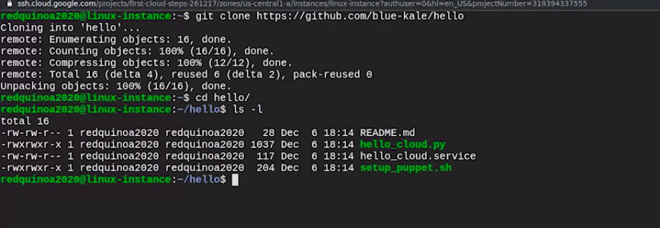</a>
						

	* The repo we've cloned includes a very simple web serving application written in Python
* Lets say our application setup is complete and is up and running
* To get our application to start automatically, we need to configure this as a service
	* Service definition file
						

						  <a href="javascript:void(0)" rel="noopener">
							 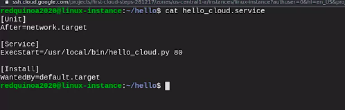</a>
						

		* This is a __systemd__ file, which is the initializing system used by most modern Linux distributions
		* Notice that the configuration expects the script that we want to execute to be in `/usr/local/bin`
			* We need to copy that file over to there and then copy the service file to `/etc/systemd/system`
				* which is the directory used for configuring systemd services
		* Finally, we need to tell the systemctl command that we want to enable this service so that it runs automatically
						

						  <a href="javascript:void(0)" rel="noopener">
							 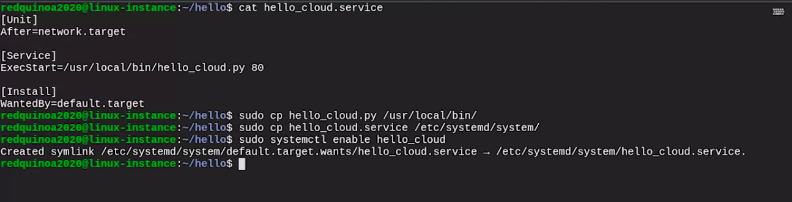</a>
						

			* Now that we've done this, anytime this machine starts, it will start the web app that we've configured and we'll be able to see the content
		* Reboot the machine
		* Once the reboot is complete
			* We can check if our application is running by using the `ps ax` command to get a list of the running processes and filter it so we keep only the ones matching a pattern using the `grep` command
				* In this case, we'll use hello as the pattern
						

						  <a href="javascript:void(0)" rel="noopener">
							 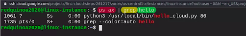</a>
						

	* We're almost ready to turn our configured VM into a template for creating a lot more of them
		* But before we do that, we need to think about how we'll upgrade our web app when we want to make changes to it
		* There's a bunch of different options here
			1. One option is to create a different reference image each time there's a new version of the app
				* This would mean deleting all the old VMs and creating new ones based on the new image
			1. Another option is to add a configuration management system to the images so that we can use that to manage any changes after the VM's created
		* We already know how to manage changes with Puppet
	* Let's install the Puppet client in this instance so it's ready to use Puppet in the future
						

						  <a href="javascript:void(0)" rel="noopener">
							 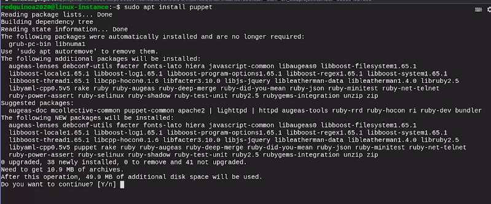</a>
						

		* Now when we looked into the Puppet Server and client setup, we saw that there was a bunch of steps that we need to run on the client side to have it ready to apply the rules
		* The repo we cloned includes a script we can run which will do the initial configuration for us
		* It will also set the Puppet process to run automatically on boot
						

						  <a href="javascript:void(0)" rel="noopener">
							 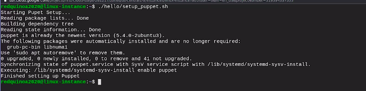</a>
						

		* Now any time this machine starts, it will serve our website and we want to update that website's content
			* We can do that using our Puppet infrastructure

### Templating a Customized VM

* 
* THIS IS A DEMO VIDEO FOR TEMPLATING a VM. NO NOTES REQUIRED

> Templating - The process of capturing the entire system configuration to enable us to reproduce virtual machines \
Effective templating software allows you to capture an entire virtual machine configuration and use it to create new ones
#
> The boot disk from which the VM boots will determine what operating system runs on the VM
#
> Puppet or other configuration management systems provide a streamlined way to deploy service updates at scale
#
> The instances parameter that follows the compute parameter tells gcloud that we want to manage our VMs on the instance level
#
> The compute parameter tells gcloud that we are managing Compute Engine resources

## Automating Cloud Deployments

### Cloud Scale Deployments

* The biggest advantage of using Cloud services is how easily we can scale our services up and down
* We'll set up our services so that we can easily increase their capacity by adding more nodes to the pool
	* These nodes could be virtual machines, containers, or even specific applications providing one service
* Whenever we have a service with a bunch of different instances serving the same purpose, we'll use a load balancer
* A __load balancer__ ensures that each node receives a balanced number of requests
	* When a request comes in, the load balancer picks a node to serve the response
	* There's a bunch of different strategies load balancer uses to select the node
		1. The simplest one is just to give each node one request called __round robin__
		1. More complex strategies include
			1. always selecting the same node for requests coming from the same origin
			1. selecting the node that's closest to the requester
			1. selecting the one with the least current load
* Instance groups like these are usually configured to spin up more nodes when there's more demand, and to shut some nodes down when the demand falls
	* This capability is called autoscaling
* __Autoscaling__ - It allows the service to increase or reduce capacity as needed while the service owner only pays for the cost of the machines that are in use at any given time
	* Since some nodes will shut down when demand is lower, their local disks will also disappear and should be considered __ephemeral__ or __short-lived__
	* If you need data persistence, you'll have to create separate storage resources to hold that data and connect that storage to the nodes
* That's why the services that we run in the Cloud are usually connected to a database which is also running in the Cloud
	* This database will also be served by multiple nodes behind a load balancer, but this is typically managed by the Cloud provider using the platform as a service model
* Example
	* let's look at an example of a web application with a lot of users
		* When you connect to a site through the Internet, your web browser first retrieves an IP address for the website that you want to visit
		* This IP address identifies a specific computer, the entry point for the sites
		* Commonly there will be a bunch of different entry points for a single website
						

						  <a href="javascript:void(0)" rel="noopener">
							 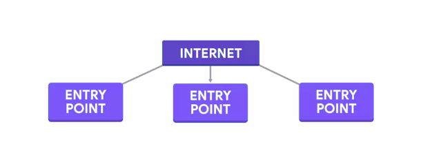</a>
						

		* This allows the service to stay up even if one of them fails
		* On top of that, it's possible to select an entry point that's closer to the user to reduce latency
			1. In a small-scale application, this entry point could be the web server that serves the pages
			1. For large applications where speed and availability matter, there will be a couple of layers in between the entry point and the actual web service
				1. The first layer will be a pool of web caching servers with a load balancer to distribute the requests among them
					* One of the most popular applications for this caching is called __Varnish__
					* The __Nginx__ web server and software also includes this caching functionality
					* There's a bunch of providers that do web caching as a service like __Cloudflare__ and __Fastly__
					* When a request is made, the caching servers first check if the content is already stored in their memory
						* If it's there, they respond with the contents, if it's not, they ask their configured backend for the content and then store it so that it's present for future requests
				1. This configured backend is the actual web service that generates the webpages for the site, and it will also normally be a pool of nodes running under a __load balancer__ 
					* To get any necessary data, this service will connect to a database
					* But because getting data from a database can be slow, there's usually an extra layer of caching, specific for the database contents
						* The most popular applications for this level of caching are __Memcached__ and __Redis__
							

							  <a href="javascript:void(0)" rel="noopener">
								 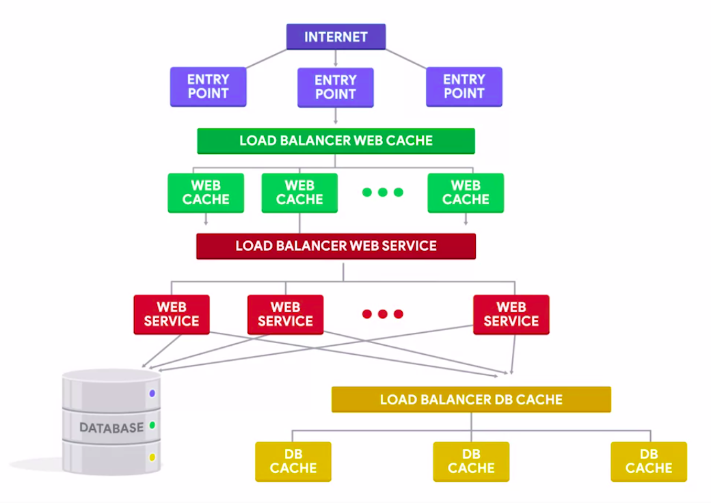</a>
							

### What is orchestration?

* __Automation__ is the process of replacing a manual step with one that happens automatically
* We can use templating to create new virtual machines
* We can run a command line tool that automatically creates new instances for us
* We can choose to enable auto-scaling and let the infrastructure tools take care of that depending on the demand
* All of this automatic creation of new instances needs to be coordinated so that the instances correctly interact with each other and that's where __orchestration__ comes into play
* __Orchestration__
	* __Orchestration__ is the automated configuration and coordination of complex IT systems and services
	* In other words, __orchestration__ means automating a lot of different things that need to talk to each other
	* This will always include a lot of different automated tasks and will generally involve configuring a bunch of different systems
	* Example
		1. say you wanted to deploy a new copy of the system in a separate data center where you have no instances yet
			* you'll need to also automate the whole configuration of the system
			* the different instance types involved, how will each instance finesse the others
			* what the internal network looks like, and so on
	* how does this work?
		* The key here is that the configuration of the overall system needs to be automatically repeatable
		* There's a bunch of different tools that we can use to do that
			* These tools typically don't communicate with the Cloud systems through the web interface or the command line
			* They normally use an application programming interface or API that lets us interact with the Cloud infrastructure directly from our scripts
		* In the case of Cloud provider APIs, they typically let you handle the configuration that you want to sit directly from your scripts or programs without having to call a separate command
		* This combines the power of programming with all of the available Cloud resources
		* The APIs offered by the Cloud providers let us perform all the tasks that we mentioned earlier like creating, modifying, and deleting instances and also deploying complex configurations for how these instances will talk to each other
		* All of these actions can also be completed through the web interface or the command line
			* But doing them from our programs gives us extra flexibility which can be key when automating complex setups
		* Say you wanted to deploy a system that combines some services running on a Cloud provider and some services running on-premise
			* This is known as a __hybrid Cloud setup__
				* where only part of the services are in the Cloud
		* Orchestration tools can be a pretty useful tool to make sure that both the on-premise services and the Cloud services know how to talk to each other and are configured with the right settings
		* Example
			* let's look at an example of a web application with a lot of users (which we discussed earlier)
				* to make sure that the service is running smoothly, we should set up a monitoring and alerting
					* This lets us detect and correct any problems with our service before users even notice
					* This is a critical piece of infrastructure but setting it up correctly can take quite some time
							

							  <a href="javascript:void(0)" rel="noopener">
								 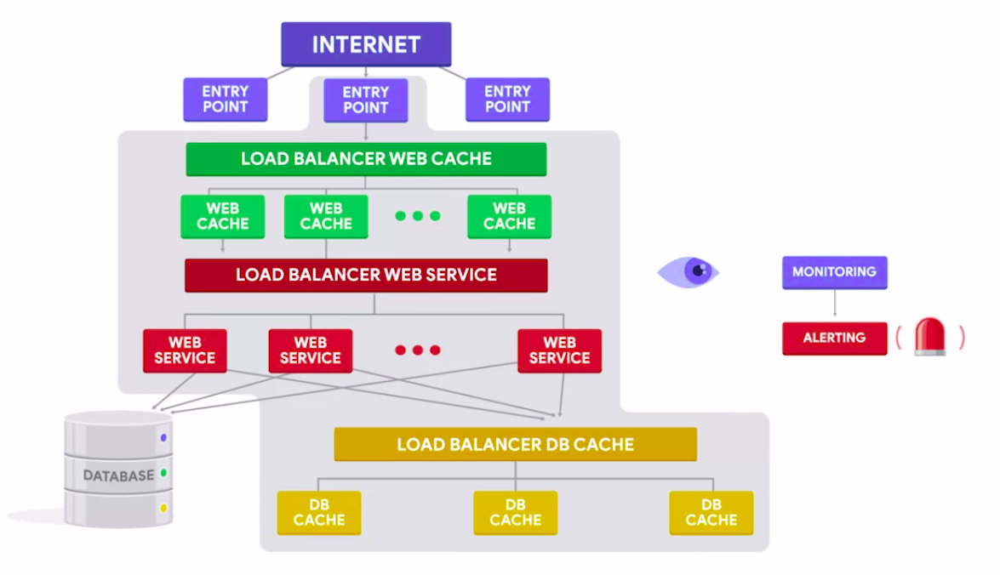</a>
							

		* By using orchestration tools, we can automate the configuration of any monitoring rules that we need to set, which metrics we want to look for, when we want to be alerted, and so on
			* automatically apply these to a complete deployment no matter which datacenter the services are running in
							

							  <a href="javascript:void(0)" rel="noopener">
								 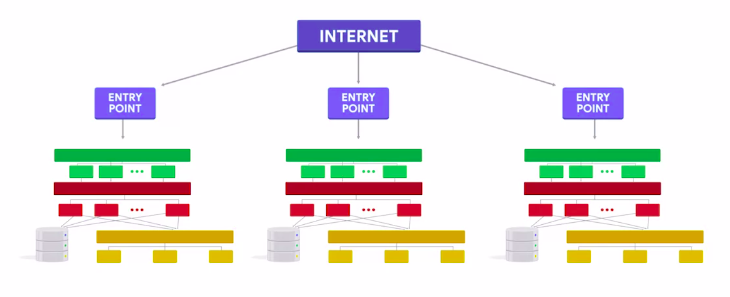</a>
							

> Automation is when we set up a single step in a process to require no oversight, while orchestration refers to automating the entire process

### Cloud Infrastructure as Code

* Most Cloud providers offer their own tool for managing resources as code
	1. Amazon has Cloud Formation
	1. Google has Cloud Deployment Manager
	1. Microsoft has Azure Resource Manager
	1. OpenStack has Heat Orchestration Templates
* These tools are specific to the Cloud provider, which means it can be complex and cumbersome to move to a different provider or combine a Cloud deployment with an on-premise deployments
* An option that's becoming really popular in the Orchestration field, is called __Terraform__
	* Similar to Puppet, Terraform uses its own Domain-specific language which lets us specify what we want our Cloud infrastructure to look like
	* It knows how to interact with a lot of different Cloud providers and automation vendors
	* So you can write your Terraform rules to deploy something on one Cloud provider, and then use very similar rules to deploy the service to a different Cloud provider
	* __Terraform__ uses each Cloud provider's API to accomplish this
		* This keeps you from having to learn a new API when moving to a different Cloud provider, and lets you focus on the infrastructure design
	* Terraform works similar to puppet, like
		* how we can have a puppet rule that specifies that a computer should install a given package, and that the local puppet agent analyzes the computer and decides which installation mechanism to use depending on the operating system, the specific Linux distro and so on
	* The rules that define the resources like the VMs or containers to use, will use specific values related to the Cloud provider like selecting which machine type to use or in what region to deploy it
		* But a lot of the overall configuration is independent of the provider, and can be reused if we decide to move our configuration to a different provider or we want to use a hybrid setup
* Puppet itself also ships with a bunch of plug-ins that can be used to interact with the different Cloud providers to create and modify the desired Cloud infrastructure
* When dealing with nodes in the Cloud, there are basically two options
							

							  <a href="javascript:void(0)" rel="noopener">
								 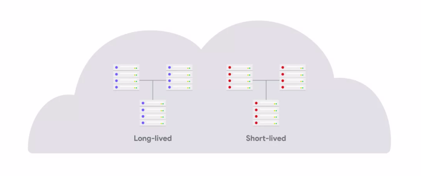</a>
							

	1. Either they're long-lived and their contents need to be periodically updated
		* Long-lived instances are typically servers that are not expected to go away
		* Things like your company's internal mail server or internal document sharing servers
			* will manage these instances using a configuration management system like Puppet, which can deploy any necessary changes to the machines while they're running
			* This keeps them updated to the latest state
							

							  <a href="javascript:void(0)" rel="noopener">
								 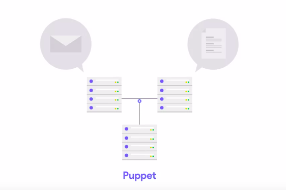</a>
							

	1. they are short-lived and updates are made by deleting the old instances and deploying new ones
		* short-lived instances come and go very quickly
		* For these cases, it makes less sense to apply changes while they're running
			* Instead, we normally apply the configuration that we want the instances to have when they start
							

							  <a href="javascript:void(0)" rel="noopener">
								 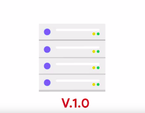</a>
							

				* and we deploy any future changes by replacing the instances with new ones
							

							  <a href="javascript:void(0)" rel="noopener">
								 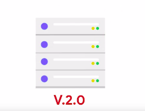</a>
							

			* We can still use Puppet for the initial setup, but we don't need to run the agent periodically, only at the start

> __IaC__ or __Infrastructure as Code__ uses special machine-readable config files to automate configuration management
#
> Monitoring and alerting allows us to monitor and correct incidents or failures before they reach the end user
#
> When you connect to a website via the Internet, the web browser first receives an IP address. This IP address identifies a particular computer: the entry point of the website
#
> Round-robin load balancing is a basic way of spreading client requests across a server group. In turn, a client request will be forwarded to each server. The load balancer is directed by the algorithm to go back to the top of the list and repeat again
#
> Autoscaling helps us save costs by matching resources with demand automatically
#
> Like Puppet, Terraform uses its own domain specific language (DSL), and manages configuration resources as code
#
> CloudFormation is a service provided by Amazon to assist in modeling and managing AWS resources
#
> Azure Resource Manager is the deployment and management service for Azure. It provides a management layer that enables you to create, update, and delete resources

