Configuration Management and the Cloud
======================================

by Google

# Module 4
#
## Title: Managing Cloud Instances at Scale

## Building Software for the Cloud

### Storing Data in the Cloud

* Cloud providers give us a lot of storage options
* Picking the right solution for data storage will depend on what service you're building
* You'll need to consider a bunch of factors, like
	1. how much data you want to store
	1. what kind of data that is
	1. what geographical locations you'll be using it in
	1. whether you're mostly writing or reading the data
	1. how often the data changes,
	1. what your budget is
* When choosing a storage solution in the Cloud
	1. you might opt to go with the __traditional__ storage technologies, like __block storage__
			

			  
			

		* When we create a __VM running in the Cloud__, it has a local disk attached to it. These local disks are an example of __block storage__
		* This type of storage closely resembles the physical storage that you have on physical machines using physical hard drives
		* Block storage in the Cloud acts almost exactly like a hard drive
		* The operating system of the virtual machine will create and manage a file system on top of the block storage just as if it were a physical drive
		* These are virtual disks, so we can easily move the data around
		* For example
			* We can migrate the information on the disk to a different location, attach the same disk image to other machines, or create snapshots of the current state
				* All of this without having to ship a physical device from place to place
		* Our block storage can be either
			1. __persistent__
				* Persistent storage is used for instances that are long lived, and need to keep data across reboots and upgrades
			1. __ephemeral__
				* Ephemeral storage is used for instances that are only temporary, and only need to keep local data while they're running
				* Ephemeral storage is great for temporary files that your service needs to create while it's running, but you don't need to keep
				* This type of storage is especially common when using containers, but it can also be useful when dealing with virtual machines that only need to store data while they're running
		* In typical Cloud setups, each VM has one or more disks attached to the machine
			* The data on these disks is managed by the OS and can't be easily shared with other VMs
		* If you're looking to share data across instances, you might want to look into some shared file system solutions, that Cloud providers offer using the __platform as a service model__
			* When using these solutions, the data can be accessed through network file system protocols like __NFS__ or __CIFS__
			* This lets you connect many different instances or containers to the same file system with no programming required
		* Block storage and shared file systems work fine when you're managing servers that need to access files
	1. You can choose __newer__ technologies, like __object__ or __blob storage__
		* If you're trying to deploy a Cloud app that needs to store application data, you'll probably need to look into other solutions like objects storage, which is also known as __blob storage__
		* __Object storage__ lets you place in retrieve objects in a __storage bucket__
			* These __objects__ are just generic files like __photos__ or __cat videos__, encoded and stored on disk as __binary data__
				* These files are commonly called __blobs__, which comes from __binary large object__
					

					  <a href="javascript:void(0)" rel="noopener">
						 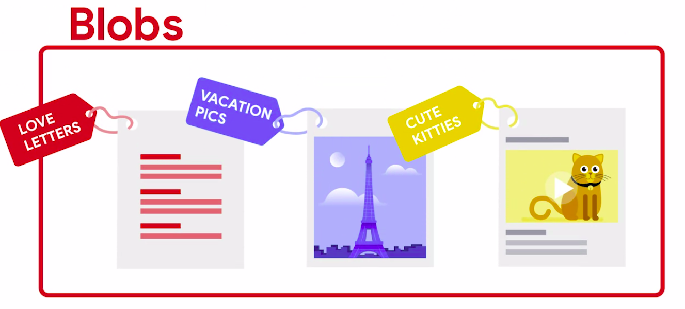</a>
					

			* These blobs are stored in locations known as __buckets__
			* Everything that you __put__ into a __storage bucket__ has a __unique name__
				* There's no file system
				* You place an object into storage with a name, and if you want that object back, you simply ask for it by name
			* To __interact with an object store__, you __need__ to use an __API__ or __special utilities__ that can interact with the specific object store that you're using
					

					  <a href="javascript:void(0)" rel="noopener">
						 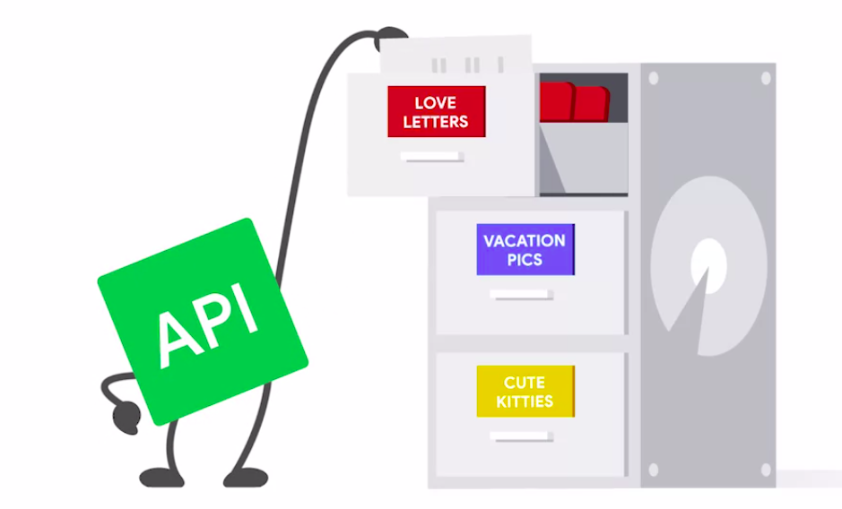</a>
					

			* Most Cloud providers offer databases as a service
				* These come in two basic flavors
					1. SQL
						* SQL databases, also known as relational, use the traditional database format and query language
						* Data is stored in tables with columns and rows that can be indexed, and we retrieve the data by writing SQL queries
						* A lot of existing applications already use this model, so it's typically chosen when migrating an existing application to the Cloud
					1. NoSQL
						* NoSQL databases offer a lot of advantages related to scale
						* They're designed to be distributed across tons of machines and are super fast when retrieving results
						* But instead of a unified query language, we need to use a specific API provided by the database
							* This means that we might need to rewrite the portion of the application that accesses the DB
* When deciding how to store your data, you'll also have to choose a __storage class__
	* Cloud providers typically offer different classes of storage at different prices
	* Variables like performance, availability, or how often the data is accessed will affect the monthly price
	* The performance of a storage solution is influenced by a number of factors, including
		1. __Throughput__
			* __Throughput__ is the amount of data that you can read and write in a given amount of time
			* The __throughput__ for __reading__ and __writing__ can be pretty different
			* For __example__, you could have a throughput of one gigabyte per second for reading and 100 megabytes per second for writing
		1. __IOPS__
			* __IOPS__ or __Input/Output Operations per Second__ measures how many reads or writes you can do in one second, no matter how much data you're accessing
			* Each read or write operation has some overhead
				* So there's a limit on how many you can do in a given second
		1. __Latency__
			* __Latency__ is the amount of time it takes to complete a read or write operation
			* This will take into account the impact of IOPS, throughput and the particulars of the specific service
			* __Read latency__ is sometimes reported as the time it takes a storage system to start delivering data after a read request has been made, also known as __time to first byte__
			* __Write latency__ is typically measured as the amount of time it takes for a write operation to complete
	* When choosing the storage class to use, you might come across terms like
		1. __Hot__
			* __Hot data__ is accessed frequently and stored in hot storage
		1. __Cold__
			* __Cold data__ is accessed infrequently, and stored in cold storage
	* These two storage types have different performance characteristics
		* For example
			* __hot storage__ back ends are usually built using __solid state disks__, which are generally faster than the traditional spinning hard disks
	* __How do you choose between one and the other?__
		* Say you want to keep all the data you're service produces for five years, but you don't expect to regularly access data older than one year
			* You might choose to keep the __last one year of data__ in __hot storage__ so you have __fast access__ to it, and __after a year__, you can __move__ your __data__ to __cold storage__ where you can still get to it, but it will be __slower__ and possibly costs more to access

### Load Balancing

* A pretty common load balancing technique is __round robin DNS__
* __Round Robin__
	* __Round Robin__ is a really common method for distributing tasks
	* Example
		1. Imagine you're giving out treats at a party
			* First, you make sure that each of your friends gets one cookie
			* Then you give everyone a second serving and so on until all of the treats are gone
			* That's the round-robin approach to eating all the cookies
	* If we want to translate a URL like my `service.example.com` into an __IP address__, we use the __DNS protocol__ or __domain name system__
		* In the simplest configuration, the URL always gets translated into exactly the same IP address
					

					  <a href="javascript:void(0)" rel="noopener">
						 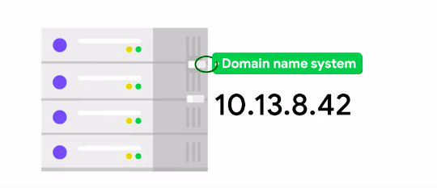</a>
					

		* But when we configure our DNS to use round robin, it'll give each client asking for the translation a group of IP addresses in a different order
		* The clients will then pick one of the addresses to try to reach the service
			* If an attempt fails, the client will jump to another address on the list
					

					  <a href="javascript:void(0)" rel="noopener">
						 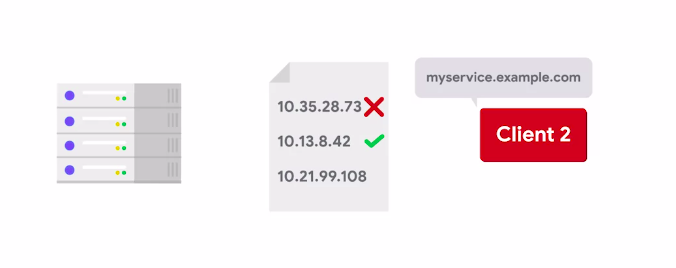</a>
					

	* This load balancing method is super easy to set up
	* You just need to make sure that the IPs of all machines in the pool are configured in your DNS server
	* It has some limitations
		1. First, you can't control which addresses get picked by the clients
		1. Even if a server is overloaded, you can't stop the clients from reaching out to it
		1. On top of that, DNS records are cached by the clients and other servers
			* So if you need to change the list of addresses for the instances, you'll have to wait until all of the DNS records that were cached by the clients expire
	* __To have more control__ over how the __load's distributed__ and to __make faster changes__, we can set up a server as a __dedicated load balancer__
		* This is a machine that acts as a proxy between the clients and the servers
		* It receives the requests and based on the rules that we provide, it directs them to the selected back-end server
					

					  <a href="javascript:void(0)" rel="noopener">
						 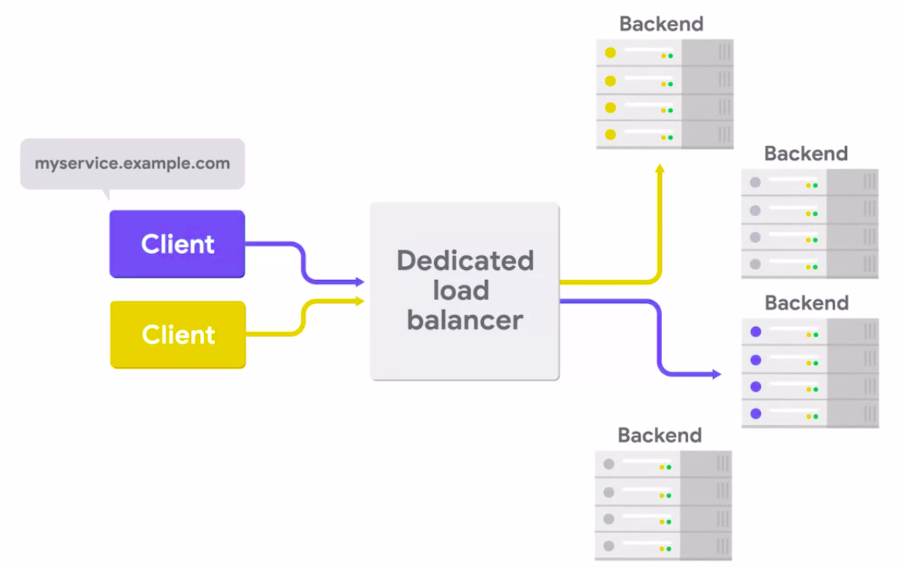</a>
					

* Load balances can be super simple or super complex depending on the service needs
	* Say your service needs to keep track of the actions that a user has taken up till now
		* In this case, you'll want your load balancer to use __sticky sessions__
		* Using __`Sticky Sessions`__ means all requests from the same client always go to the same back end server
		* This can be really useful for services than need it but can also cause headaches when migrating or maintaining your service
			* So you need to use it only if you really need it
* Another __feature__ of __load balancers__ is that you can configure them to __check the health of the backend servers__
	* Typically, we do this by making a simple query to the servers and checking that the reply matches the expected reply
	* If a back-end server is unhealthy, the load balancer will stop sending new requests to it to keep only healthy servers in the pool
					

					  <a href="javascript:void(0)" rel="noopener">
						 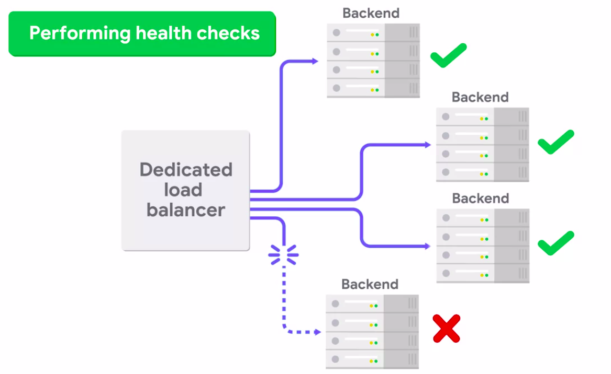</a>
					

* A cool feature of cloud infrastructure is how easily we can add or remove machines from a pool of servers providing a service
	* If we have a load balancer controlling the load of the machines, adding a new machine to the pool is as easy as creating the instance
		* And then letting the load balancer know that it can now route traffic to it
	* We can do this by manually creating and adding the instance or when our services under heavy load, we can just let the auto scaling feature do it
* __How do you make sure that clients connect to the servers that are closest to them?__
	* You can use __Geo DNS__ and __geoip__
	* These are __DNS configurations__ that will __direct__ your __clients__ to the __closest geographical load balancer__
	* The mechanism used to route the traffic relies on how the DNS servers respond to requests
	* For Example
		* From machines hosted in North America, a DNS server in North America might be configured to respond with the IPs in, you guessed it, North America
			* most Cloud providers offer it as part of their services making it much easier to have a geographically distributed service
* __CDN__ or __Content Delivery Networks)__
	* There are some providers dedicated to bringing the contents of your services as close to the user as possible
	* **CDN make up a network of physical hosts that are geographically located as close to the end user as possible**
		* This means that **CDN servers** are often in the same data center as the users Internet service provider
		* **CDNs** work by caching content super close to the user
	* Example
		* When a user requests say, a cute cat video, it's stored in the closest CDN server
			* That way, when a second user in the same region requests the same cat video, it's already cached in a server that's pretty close and it can be downloaded extra fast
					

					  
					

> The **Round-robin approach** serves clients one at a time, starting with the first, and making rounds until it reaches the beginning again.

### Change Management

* Most of the time when something stops working, it's because something changed. If we want our cloud service to be stable, we might be tempted to avoid changes altogether
	* But change is a fact of cloud life
	* If we want to fix bugs and improve features in our services, we have to make changes
	* But we can make changes in a controlled and safe way
		* This is called __change management__
		* it's what lets us keep innovating while our services keep running
	* Step one in improving the safety of our changes
		* We have to make sure they're well-tested
			* This means running unit tests and integration tests, and then running these tests whenever there's a change
		* A __continuous integration system__ will build and test our code every time there's a change
			* Ideally, the __CI system__ runs even for changes that are being reviewed
				* That way you can catch problems before they're merged into the main branch
			* You can use a common open source __CI system__ like __Jenkins__, or if you use __GitHub__, you can use its __Travis CI integration__
			* Many cloud providers also offer __continuous integration as a service__
				* Once the change has committed, the __CI system__ will build and test the resulting code
			* You can use __continuous deployment__, or __CD__, to automatically deploy the results of the build or build artifacts
				* __Continuous deployment__ lets you control the deployment with rules
				* For example, we usually configure our CD system to deploy new builds only when all of the tests have passed successfully
				* On top of that, we can configure our CD to push to different environments based on some rules
			* Having them separate __environment__ lets us validate that changes work correctly before they affect users
				* __Environment__ means everything needed to run the service
					* It includes
						1. the machines and networks used for running the service
						1. the deployed code
						1. the configuration management
						1. the application configurations
						1. the customer data
			* Production, usually shortened to prod, is the real environment, the ones users see and interact with
				* Because of this, we have to protect, love, and nurture a prod
			* The test environment needs to be similar enough to prod that we can use them to check our changes work correctly
				* You could have your CD system configured to push new changes to the test environment
				* You can then check that the service is still working correctly there
				* then manually tell your deployment system to push those same changes to production
						

						  <a href="javascript:void(0)" rel="noopener">
							 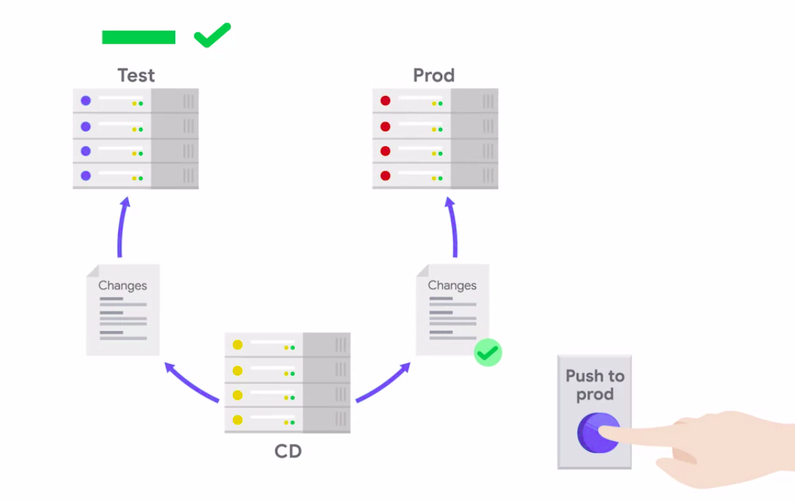</a>
						

			* If the service is complex and there are a bunch of different developers making changes to it, you might set up additional environments where the developers can test their changes in different stages before releasing them
				* For example
					* you might have your CD system push all new changes to a development or dev environment, then have a separate environment called pre-prod, which only gets specific changes after approval
					* And only after a thorough testing, these changes get pushed to prod
						

						  <a href="javascript:void(0)" rel="noopener">
							 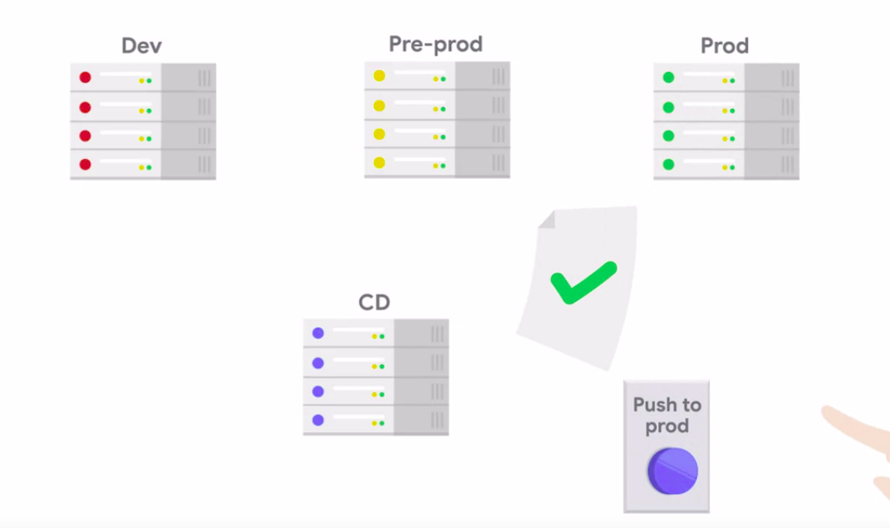</a>
						

			* __Remember__, these environments need to be as similar to prod as possible
			* They should be built and deployed in the same way
				* And while we don't want them to be breaking all the time, it's normal for some changes to break dev or even pre-prod
* A/B Testing
	* In A/B testing, some requests are served using one set of code and configuration, A, and other requests are served using a different set of of code and configuration, B
	* This is another place where a load balancer and instance groups can help us out. You can deploy one instance group in your A configuration and a second instance group in your B configuration
		* Then by changing the configuration of the load balancer, you can direct different percentages of inbound requests to those two configurations
						

						  <a href="javascript:void(0)" rel="noopener">
							 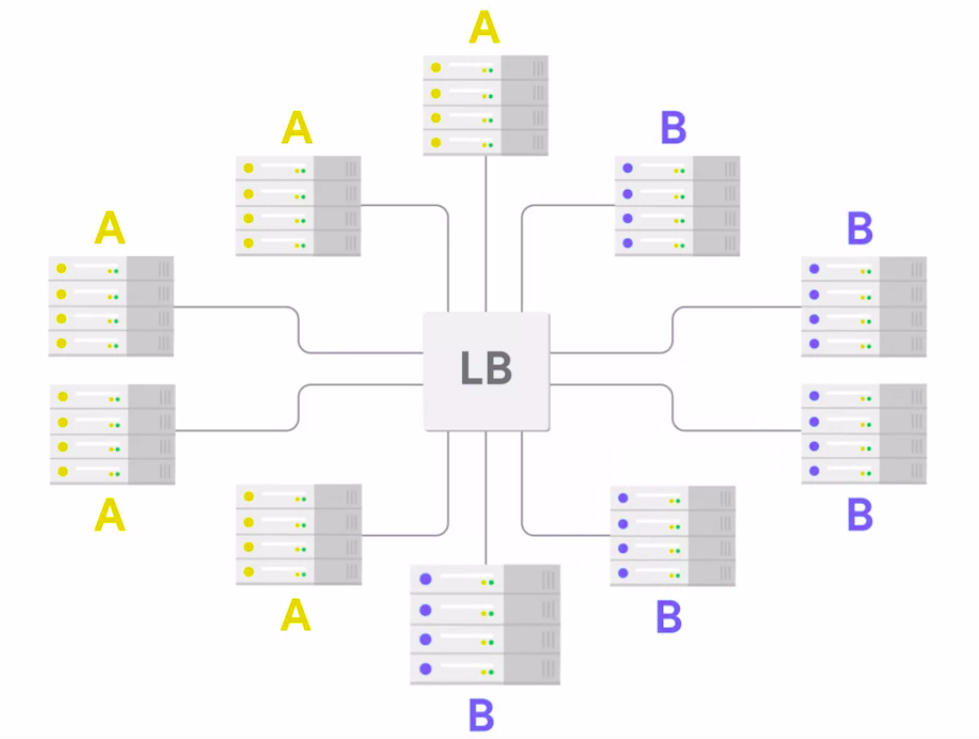</a>
						

	* Example
		1. If your A configuration is today's production configuration and your B configuration is something experimental, you might want to start by only directing 1 % of your requests to B
			* Then you can slowly ramp up the percentage that you check out whether the B configuration performs better than A, or not
	* Make sure you have basic monitoring so that it's easy to tell if A or B is performing better or worse
		* If it's hard to identify the back-end responsible for serving A requests or B requests, then much of the value of A/B testing is lost to A/B debugging

### Understanding Limitations

* __Quota__ or __limits__
	* Meaning that you can only perform a certain number of operations within a certain time period
	* For example
		* when using Blob Storage there might be a limit of 1,000 writes to the same blob in a given seconds
	* If your service performs a lot of these operations routinely, it might get blocked by these limits
	* In that case, you'll need to see if you can change the way you're doing the operations
		* for example by grouping all of the calls into one batch
	* Switching to a different service is sometimes an option too
	* **Rate Limits** on these calls to prevent one service from overloading the whole system
		* For example
			1. there might be a rate limit of one call per second for an expensive API call
			1. On top of that, there are also utilization limits, which cap the total amount of a certain resource that you can provision
	* These quotas are there to help you avoid unintentionally allocating more resources than you wanted
	* Example
		* Imagine you've configured your service to use auto scaling and it suddenly receives a huge spike in traffic.
			* This could mean a lot of new instances getting deployed which can cost a lot of money
	* For some of these limits, you can ask for a quota increase from the Cloud provider if you want additional capacity, and you can also set a smaller quota in the default to avoid overspending
	* If your service performance expensive operations routinely, you should make sure you understand the limitations of the solution that you choose
		* A lot of platform as a service and infrastructure as a service offerings have costs directly related to how much they're used
		* They also have usage quotas
	* By imposing a quota on an auto-scaling system, the system will grow to meet user demand until it reaches the configured limit
		* The trick here is to have good monitoring and alerting around behavior like this
	* If your system runs out of quota but there's an increased demand for a puppy videos, the system may have problems, degraded performance or worse yet an outage
		* So you want to be notified as soon as it happens that you can decide whether to increase your quota or not
* __Dependencies__
	* When your service depends on a Platform as a Service offering like a hosted database or CICD system, you're handing the responsibility for maintenance and upgrades of that service off to your Cloud provider
		* but it also means that you don't always get to choose what version of that software you're using
	* Your Cloud provider has a strong incentive to keep its service software fairly up-to-date
		* Keeping software as a service solutions up to date ensures that customers aren't vulnerable to security flaws, that bugs are promptly fixed and that new features get released early
		* At the same time, the Cloud provider has to move carefully and test changes to keep destruction of its service to a minimum
		* They will communicate proactively about changes to the services that you use and in some cases, Cloud providers might give you access to early versions of these services
		* For example
			* you can set up a test environment for your service that uses the beta or prerelease version of a given software as a service solution, letting you test it before it impacts production

> Everything used to run the service is referred to as the environment. This includes the machines and networks used for running the service, the deployed code, the configuration management, the application configurations, and the customer data
#
> CDNs allow an ISP to select the closest server for the content it is requesting
#
> Our cloud provider can increase our limits that we have set, though it will cost more money
#
> Sticky sessions can cause unexpected results during migration, updating, or upgrading, so it's best to use them only when absolutely necessary
#
> Because sticky sessions can cause uneven load distribution as well as migration problems, they should only be used when absolutely necessary
#
> Sticky sessions route requests for a particular session to the same machine that first served the request for that session
#
> Latency is the amount of time it takes to complete a read or write operation

## Monitoring and Alerting

### Getting Started with Monitoring

* We want to make sure that our service keeps running, and not just that, we want to make sure it keeps behaving as expected, returning the right results quickly and reliably
	* The key to ensuring all of this, is to set up good __monitoring__ and __alerting__ __rules__
* Monitoring
	* Monitoring lets us look into the history and current status of a system
	* How can we know what the status is?
		* We'll check out a bunch of different metrics
		* These metrics tell us if the service is behaving as expected or not
		* Well, some metrics are generic, like how much memory an instance is using
		* Other metrics are specific to the service we want to monitor
			1. Say your company is running a website and you want to check if it's working correctly
				* When a web server responds to an HTTP request, it starts by sending a response code, followed by the content of the response
					* You might know, for example
						* that a 404 code means that the page wasn't found
							

							  
							

						* that a 500 response means that there was an internal server error
							

							  <a href="javascript:void(0)" rel="noopener">
								 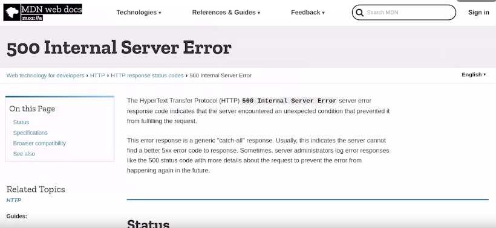</a>
							

					* In general, response codes in the 500 range, like 501 or 503, tells us that something bad happened on the server while generating a response
					* Well, response codes in the 400 range means there was a client-side problem in the request
				* When monitoring your web service, you want to check both the count of response codes and their types to know if everything's okay
			1. If you're running an e-commerce site, you'll care about how many purchases were made successfully and how many failed to complete
			1. If you're running a mail server, you want to know how many emails were sent and how many got stuck
		* You'll need to think about the service you want to monitor and figure out the metrics you'll need
	* __Now, once we've decided what metrics we care about, what do we do with them?__
		* We'll typically store them in the monitoring system.
		* There's a bunch of different monitoring systems out there
		* Some systems like __AWS Cloudwatch__, __Google Stack Driver__, or __Azure Metrics__ are __offered__ directly __by the Cloud providers__
		* Other systems like __Prometheus__, __Datadog__, or __Nagios__ can be __used across vendors__
		* There's two ways of getting our metrics into the monitoring system
			1. Some systems use a pull model, which means that the monitoring infrastructure periodically queries our service to get the metrics
			1. Other monitoring systems use a push model, which means that our service needs to periodically connect to the system to send the metrics
						

						  <a href="javascript:void(0)" rel="noopener">
							 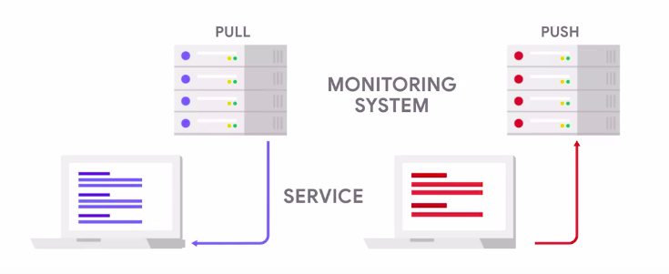</a>
						

	* __NOTE:__ You only want to store the metrics that you care about, since storing all of these metrics in the system takes space, and storage space costs money
* __Whitebox Monitoring__
	* When we collect metrics from inside a system, like how much storage space the service is currently using or how long it takes to process a request, this is called __whitebox monitoring__
		* __Whitebox monitoring__ checks the behavior of the system from the inside
		* We know the information we want to track, and we're in charge of making it possible to track
			* For example, if we want to track how many queries we're making to the database, we might need to add a variable to count this
* __Blackbox Monitoring__
	* Blackbox monitoring checks the behavior of the system from the outside
	* This is typically done by making a request to the service and then checking that the actual response matches the expected response
	* We can use this to do a very simple check to know if the service is up and to verify if the service is responding from outside your network
		* Or we could use it to see how long it takes for a client in a different part of the world to get a response from the system

### Getting Alerts When Things Go Wrong

* It's much better to create automation that checks the health of your system and notifies you when things don't behave as expected
* This can give you advance warning that something's wrong, sometimes even before users notice a problem at all
* So how do we do that?
	* The most basic approach is to run a job periodically that checks the health of the system and sends out an email if the system isn't healthy
	* On a Linux system
		* We could do this using cron, which is the tool to schedule periodic jobs
		* We'd pair this with a simple Python script that checks the service and sends any necessary emails
		* This is an extremely simplified version of an alerting system, but it shares the same principles. Is all alerting systems, no matter how complex and advanced
		* We want to periodically check the state of the service and raise alerts if there's a problem
	* You can configure the system to periodically evaluate the metrics; and based on some conditions, decide if an alert should be raised
* Raising an alert signals that something is broken and a human needs to respond
* For example
	1. you can set up your system to raise alerts if the application is using more than 10 gigabytes of RAM
	1. if it's responding with too many 500 errors
	1. if the queue of requests waiting to get processed gets too long
* We typically divide useful alerts into two groups
	1. those that need immediate attention
		* Example
			* If your web service is responding with errors to 50 percent of the requests, you should look at what's going on right away
	1. those that need attention in the near future
		* Example
			* if the issue is that the attached storage is 80 percent full, you need to figure out whether to increase the disk size or maybe clean up some of the stored data
* __NOTE:__ If an alert doesn't need attention, then it shouldn't have been sent at all. It's just noise
* __Those that need immediate attention__ are called __pages__, which comes from a device called a pager
	* Before mobile phones became popular, pagers were the device of choice for receiving urgent messages
	* Nowadays, most people receive their pages in other forms like
		1. SMS
		1. automated phone calls
		1. emails
		1. through a mobile app
* __The non-urgent alerts__ are usually configured to create bugs or tickets for an IT specialist to take care of during their workday
	* They can also be configured to send email to specific mailing lists or send a message to a chat channel that will be seen by the people maintaining the service
* __NOTE:__ all alerts should be actionable
	* If you get a bug or a page and there's nothing for you to do, then the alert isn't actionable and it should be changed or it shouldn't be there at all. Otherwise, it's just noise
* Example
	* Say you run a cron job that copies files from one location to another every 10 minutes, you want to check that this job runs successfully
						

						  
						
	
		* So you configure your system to alert you if the job fails
		* After putting this in production, you realize there's a bunch of unimportant reasons that can cause this job to temporarily fail
						

						  
						

			* Maybe the destination storage is too busy and so sometimes the job times out
			* Maybe the origin was being rebooted right when the job started, so the job couldn't connect to it
		* No matter why, whenever you go to check out what caused a job to fail, you discover that the following run had succeeded and there's nothing for you to do
		* You need to re-think the problem and tweak your alert
			* Since the task is running frequently, you don't care if it fails once or twice, you can change the system to only raise the alert if the job fails three times in a row
			* That way when you get a bug, it means that it's failing consistently and you'll actually need to take action to fix it

> Pages are alerts that need immediate human attention, and are often in the form of SMS or email

### Service-Level Objectives

* Sometimes a piece of infrastructure can be down and the overall system still works with degraded performance
	* For example
		* if the caching server that makes your web application go faster is down, the app can still function, even if it's running slower
* No system is ever available 100% of the time, it's just not possible
* But depending on how critical the service is, it can have different __service level objectives__, or __SLOs__
* __SLOs__ or __Service Level Objectives__
	* __SLOs__ are pre-established performance goals for a specific service
	*  Setting these objectives helps manage the expectations of the service users, and the targets also guide the work of those responsible for keeping the service running
	* __SLOs__ need to be measurable
		* which means that there should be metrics that track how the service is performing and let you check if it's meeting the objectives or not
	* Many SLOs are expressed as how much time a service will behave as expected
	* For Example
		* a service might promise to be available 99% of the time
	* If our service has an SLO of 99% availability, it means it can be down up to 1 % of the time
		* If we measure this over a year, the service can be down for a total of 3.65 during the year and still have 99% availability
	* Availability targets like this one are commonly named by their number of nines
		* Our 99% example would be a two 9 service, 99.9% availability is a three 9 service, 99.999% availability is a five 9 service
	* Five nine services promised a total down time of up to five minutes in a year
		* Five nines is super high availability, reserved only for the most critical systems
	* A three nine service, aiming for a maximum of eight hours of downtime per year, is fine for a lot of IT systems
	* If your service isn't super critical and it's okay for it to be down briefly once in a while having two or three nines of availability might be enough
	* Five nine services usually require a much larger team of engineers to maintain it
* Some services, like those that we pay for, also have more strict promises in the form of __service level agreements__, or __SLAs__
* __SLAs__ or __Service Level Agreements__
	* A __service level agreement__ is a commitment between a provider and a client
	* Breaking these promises might have serious consequences
* __Service level objectives__ or __SLOs__ though are more like a __soft target__, it's what the maintaining team aims for, but the target might be missed in some situations
* Having explicit __SLOs__ or __SLAs__ is useful for both the users of that service and the team that keeps the service running
* If you're using a cloud service, you can decide how much you're going to entrust your infrastructure to it, based on the __SLAs__ that the provider __publishes__
* If on the other hand you're part of the team that maintains the service, you can use the __SLOs__ and __SLAs__ of your service to decide which alerts to create and how urgent they should be
	* Example
		1. Say you have a service with an SLO that says that at least 90% of the requests should return within 5 seconds
			* To know if your service is behaving correctly, you need to measure how many of the total requests are returning within those 5 seconds, and you want that number to always be above 90%.
							

							  <a href="javascript:void(0)" rel="noopener">
								 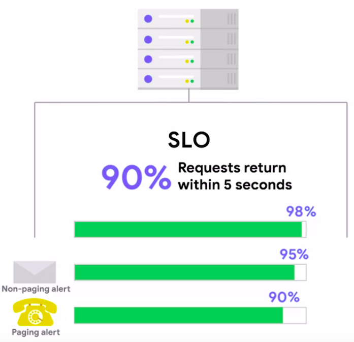</a>
							

			* So you might set up
				1. a non-paging alert to notify you if less than 95% return within 5 seconds
				1. a paging alert if less than 90% return promptly
		1. If you're in charge of a website, you'll typically measure the rate of responses with 500 return codes to check if your service is behaving correctly
			* If your SLO is 99% of successful requests, you can set up
				1. a non-paging alert if the rate of errors is above 0.5%
				1. a paging alert if it reaches 1%
* If your service was working fine and meeting all of its SLOs and then started misbehaving, it's likely this was caused by a recent change
	* That's why some teams use the concepts of __error budgets__ to handle their services
* Example
	* Say you're running a service that has three nines of availability
		* This means the service can be down 43 minutes per month, this is your error budget
		* You can tolerate up to 43 minutes of downtime, so you keep track of the total time the service was down during the month
		* If it starts to get close to those 43 minutes, you might decide to stop pushing any new features and focus on resolving the problems that keep causing the downtime

### Basic Monitoring in GCP

* __THIS IS DEMONSTRATION LECTURE. NOTHING MUCH TO WRITE DOWN__
* Tool used: __Stackdriver__
	* When you first activate this system, it takes a while until it starts collecting on the metrics from all the machines
* The monitoring system gives us a very simple overview of each of the instances with three basic metrics, CPU usage, Disk I/O, and network traffic
* Depending on what surface we want to run on a VM, we can customize these dashboards to show different metrics
* If the metrics that come baked in aren't enough, you can create your own metrics and also add them here
* To set up a new alert, we have to configure the **condition** that triggers the __alert__
	* After we've done that, we can also configure how we want to be notified of the issue and add any documentation that we want the notification to include

> An Alerting Policy specifies the conditions that trigger alerts, and the actions to be taken when these alerts are triggered, like sending an email address notification.
#
> A service-level agreement is an arrangement between two or more parties, one being the client and the other being service providers
#
> If an alert notification is not actionable, it should not be an alert at all
#
> Which part of an HTTP message from a web server is useful for tracking the overall status of the response and can be  monitored and logged? \
The response code in the server's message \
We can log and monitor these response codes, and even use them to set alert conditions
#
> To set up a new alert, we have to configure the condition that triggers the alert \
We must define what occurence or metric threshold will serve as a conditional trigger for our alert
#
> A white-box monitoring system is one that collects metrics internally, from within the system being monitored

## Troubleshooting and Debugging

### What to Do When You Can't Be Physically There

* If you're used to troubleshooting problems on physical computers
	* It can take a bit of a mindset shift to get used to fixing problems with virtual machines running in the cloud
* There's a bunch of things that you can't do, you can't walk up to a server and check out what's wrong with it
* But there's also other things that are a lot simpler when troubleshooting VMs in the cloud
	* Like
		1. adding more memory
		1. moving the machine to a different data center
* Example
	1. Let's say that after the latest upgrade
		* a bunch of your cloud VMs have stopped booting. Something went wrong, but you don't know exactly what
							

							  <a href="javascript:void(0)" rel="noopener">
								 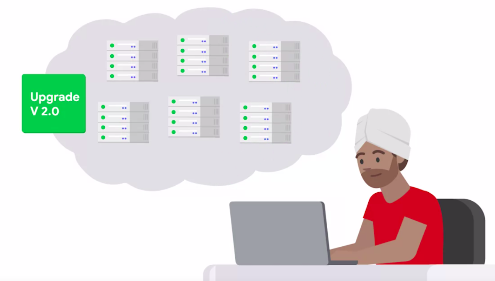</a>
							

		* You can't connect to the instances or boot them in rescue mode
		* so what can you do?
			* There's a bunch of options
				1. You could deploy new VMs with the previous version of the system, this would help us get back to a healthy state as quickly as possible
				1. On top of this, you want to understand the problem and how to fix it
					* To do that, you can create a snapshot of the disk image for one of the failing VMs
					* And then mount that disk image on a healthy machine
					* That way you can analyze the contents of the image and figure out what's causing the failures
	1. If you're trying to figure out what's causing your complex servers to respond with a ton of 500s
		* You need to look at different pieces individually until you find the culprit
			1. Does the problem happen if you run the service and a test VM?
			1. Without any load balancers or caching servers in between?
			1. Does it happen if you run the service locally on your workstation?
		* The more you can isolate the faulty behavior, the easier it is to fix it
	1. Say you're using a database service that's only reachable from inside your cloud network
		* This means you can't interact with it directly from the outside, only from instances within your cloud infrastructure
		* If your service starts acting up, you might want to check the responses from the database directly
			* Rather than going through any of the other back-end servers
		* To do this, you'll need to have a debugging machine in the network and you'll need to use tools to interact with the database directly
* When you run your service in the cloud, you need to learn where to find the logs
	* That the provider keeps and what info is available in which logs
	* Some cloud providers offer centralized log solutions to collect all your logs in one place
	* You can have all your notes, send info, warning and error messages to the log collection point
	* Then, when you're trying to debug a problem, you can easily see everything that was going on when the error occurred

### Identifying Where the Failure Is Coming From

* **Rollback** is the process of restoring a database or program to a previously defined state, usually to recover from an error
* **Containers** are packaged applications that are shipped together with their libraries and dependencies
	* Each application is executed in a separate container, completely independent of any other applications running on the same machine
	* Now, one of the neat characteristics of containerized applications is that you can deploy the same container to your local workstation to a server running on-premise or to cloud infrastructure provided by different vendors
	* This can be really helpful when trying to understand if the failure is in the code or the infrastructure
		* You simply deploy the container somewhere else and check if it behaves the same way
	* When using containers, the typical architecture is to have a lot of small containers that take care of different parts of the service
		* This means that the overall system can get really complex and when something breaks, it can be hard to identify where the problem is coming from
		* The key to solving problems in the container world is to make sure you have good logs coming in from all of the parts of the system
			* And, that you can bring up test instances of each of the applications to try things out when necessary

### Recovering from Failure

* If we want our service to be reliable, we need to make sure that we can get it up and running as quickly as possible when bad things happen
* We'll need to have good backups and a well-documented recovery plan
* Backups here doesn't mean just copies of your data
	* It also means backups for the different pieces of your infrastructure, including the instances that are running the service and the network that's used to connect to the service
	* Backups of the data your service handles are extremely important
* If you operate a service that stores any kind of data, it's critical that you implement __automatic backups__ and that you __periodically check__ that those backups are working correctly by __performing restores__
	* This helps make sure that you're backing up the right data and that you have well-documented processes for recovering it when things fail
* If you store all your Infrastructure as code, you already have a backup of what your infrastructure should look like
	* But if your service goes down for some reason, deploying all that infrastructure from scratch might take awhile
	* That's why many teams keep backup or a secondary instances of their services already up and running
	* That way, if there's a problem with the primary instance, they can simply point the load balancer or the DNS entries to the secondary instance with minimal disruption to the service
* Alternatively, it's common practice to have enough servers running at any time so that if one of them goes down, the others can still handle the traffic
	* or on a larger scale, have the service running on different data centers around the world, so that if one of the data centers has a problem, the service can still be provided by the instances running in the other data centers
* If you're running a service on-premise, you might want to have two different connections to the Internet
	* This way, if the connection offered by one of your ISPs goes down, you can still connect to the Internet through the other one
* When you're running on Cloud, you can mostly rely on your Cloud provider having enough network redundancy
* But if you really care about your service staying up no matter what, you might want to run your service on two different Cloud vendors so that if one of the providers has a large outage, you can still rely on the other
* Example
	1. Now, imagine you're running your service in one data center. Unfortunately, that data center has just suffered a natural disaster, and all of your instances are down
		* What do you do?
			1. You need to recover your service from scratch, deploying it in a different data center and getting all your data from backups
				* As long as the backups are available in other data centers and your Infrastructure is fully stored in a version control system, this should be possible
				* But figuring out how to successfully bring up the whole system from scratch can take a while
				* You should have a documented procedure that explains all of the steps that you need to take
					* Since systems evolve over time, you need to make sure that this documentation stays up-to-date
					* One way to do that is to once in a while pretend that you need to recover your service, follow the documented steps, and check if anything is missing or outdated

> A quick way to recover is to have a secondary instance of the VM running your service that you can quickly switch to
#
> As long as you've been keeping frequent backups, restoring a previous VM image will often get you where you need to be
#
> Rolling Back to a Previous Working Version - If the problem is related to recent changes or updates, rolling back to a previous working version of the service or supporting software will give the time to investigate further
#
> If your primary VM instance running your service fails, having a secondary instance running in the background ready to take over can provide instant failover
#
> Having a secondary Cloud service provider on hand with your data in case of the first provider having large-scale outages can provide redundancy for a worst-case scenario
#
> Test backups by restoring - It's important to know that our backup process is working correctly. It would not do to be in a recovery situation and not have backups

